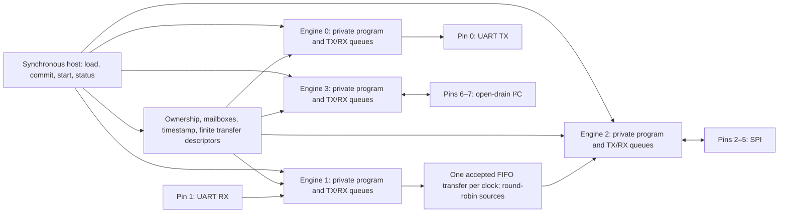

     

# Protocol Emulator: four concurrent programmable I/O engines

- [Read the documentation for project](docs/info.md): the datasheet, with the host protocol, ISA reference and a worked example.

This is a Tiny Tapeout project for the IHP SG13CMOS5L 130 nm process and an
entry in the
[Jane Street protocol emulator ASIC competition](https://blog.janestreet.com/protocol-emulator-asic-competition/).
The chip is a small programmable protocol processor. Four engines run their
own programs at the same time on eight shared bidirectional pins. Each engine
fetches from a private 64-instruction program memory (two IHP SRAM macros)
and has 8-word TX and RX queues, shift and scratch registers, a repeat
counter and a wait timer. UART, SPI, I2C, JTAG and timed waveforms are
firmware; none is hardwired. Event mailboxes, input triggers, a common
timestamp and an autonomous mover coordinate the engines; the mover forwards
queue words between engines without the host, for example UART receive into
SPI transmit. A synchronous nibble-wide host port on `ui_in`/`uo_out` loads
and controls everything. The hardware is written in
[Hardcaml](https://github.com/janestreet/hardcaml): `src/protocol_emulator_core.v`
is generated from `hardcaml/`, and `src/project.v` is a thin Tiny Tapeout
wrapper (`tt_um_teslacoilerow_protocol_emulator`).

<!-- ENTRANT: pitch paragraph in your own words -->
> *Placeholder: the entrant's own pitch paragraph goes here.*



The pin assignment shown is the flagship example (`firmware/flagship-scenario.json`);
ownership is set by the host.

## What is different

1. **Isolated engines and a host-free mover.** Each engine fetches from its
   own SRAM, drives only the pins it owns, and its timing changes only at its
   own stall points; apart from `START`, `STOP` and `BEGIN`, the host port and
   the mover never delay its instructions. The mover forwards words from one
   engine's RX queue to another's TX queue without the host
   ([docs/architecture.md](docs/architecture.md)).
2. **Per-image timing certificates, extended by an isolation proof.** For each
   firmware image, a static analyzer predicts the clock edge of every pad
   change, and generated SymbiYosys proofs check that schedule on the RTL; an
   unbounded two-copy proof per engine extends it to any activity of the other
   engines and the host, apart from the host's commands to that engine
   ([docs/timing-certificates.md](docs/timing-certificates.md)).
3. **Netlist equivalence in CI.** After each official build of `main`, the
   `equivalence` workflow proves the gate-level netlist from the Tiny Tapeout
   flow sequentially equivalent to the RTL, for the 8x4 build and the 6x4
   fallback; an undecided result fails ([docs/equivalence.md](docs/equivalence.md)).

How these fit with the other checks, and what they do not establish, is in
[docs/verification.md](docs/verification.md).

## Status (2026-09-28)

| | |
|---|---|
| Official build, 8x4 | The Tiny Tapeout `gds`, `precheck` and `gl_test` jobs pass. The `viewer` job fails because GitHub Pages is not enabled; it only publishes a preview, but it turns the gds badge red. |
| Clock | Signed off at 15 ns (66.7 MHz), with setup and hold met at all three corners; operated at 50 MHz. Operation above 50 MHz is not claimed. |
| 6x4 fallback | The `diet4` variant (4-word queues, 7-bit PC, byte-lane shifts) passes `gds`, `precheck` and `gl_test` in the `gds_6x4` workflow at 20 ns (50 MHz). Whether 8x4 is allowed is still to be confirmed by the organizers. |
| Timing certificates | Proved for the 19 images committed at `c118027`, sixteen of which are unchanged. The three I2C controller images revised since then, and any image added later, await certification. |
| Silicon and hardware | No silicon: nothing has been measured on a chip. FPGA bitstreams exist, but no board has been programmed yet, and the host library has not run on hardware. |
| Details | [docs/signoff-history.md](docs/signoff-history.md): official runs, superseded configurations and the 50 MHz re-analysis. [docs/results.md](docs/results.md): every number with its evidence. |

## Documentation

| Page | Contents |
|---|---|
| [docs/overview.md](docs/overview.md) | Two-page overview, with a comparison against RP2040 PIO and other public entries |
| [docs/verification.md](docs/verification.md) | The verification argument: what is proven, bounded, tested or open |
| [docs/results.md](docs/results.md) | Every headline number, its evidence and the command that reproduces it |
| [docs/limitations.md](docs/limitations.md) | What the verification does not establish |
| [docs/info.md](docs/info.md) | Datasheet (rendered by the Tiny Tapeout docs action) |
| [docs/isa.md](docs/isa.md), [docs/architecture.md](docs/architecture.md), [docs/firmware.md](docs/firmware.md) | ISA and host-protocol contract, architecture notes, firmware and assembler contract |
| [docs/bug-ledger.md](docs/bug-ledger.md) | Each defect the verification found, the method that found it and its fix |
| [docs/signoff-history.md](docs/signoff-history.md) | Sign-off record, including superseded configurations and the milestone plan |
| [docs/extension.md](docs/extension.md) | Line-coding and CRC-16 extension, built on a branch; not the design of record |

## Build, test and prove

Requirements: OCaml 5.2.1 with the opam packages pinned in
`scripts/opam-deps.txt` (dune 3.20.2, hardcaml v0.17.0, yojson 2.2.2,
digestif 1.3.1); cocotb 2.0.1 and Icarus Verilog; Yosys and SymbiYosys.

```sh
make generate            # scripts/generate.sh configs/instruction-sram-32.json
make check-generated     # regenerate and fail if the committed core differs (the regen action)
make lint                # iverilog, yosys hierarchy and verilator -Wall
(cd test && pip install -r requirements.txt && make clean && make)   # cocotb suite on the RTL
formal/run.sh --list     # SymbiYosys job names; formal/run.sh runs them all (the formal action)
make reproduce           # the local checks behind docs/results.md; reproduce-full adds the longer ones
```

The cocotb tests run the design in lockstep with a Python reference model of
the ISA and check protocol results at the pins ([test/README.md](test/README.md)
covers gate-level runs with `GATES=yes` and the constrained-random test).
[formal/README.md](formal/README.md) lists each formal claim and its method.
The firmware assembler is `hardcaml/bin/assemble.ml` ([docs/firmware.md](docs/firmware.md)),
and [docs/hardening.md](docs/hardening.md) covers the `gds` flow of record.

## Repository layout

| Path | Contents |
|---|---|
| `info.yaml`, `docs/info.md` | Tiny Tapeout metadata, pinout and datasheet |
| `src/` | `project.v` (top module), the generated core, LibreLane configuration |
| `hardcaml/`, `configs/` | Hardcaml hardware, assembler, firmware library, generators; configurations |
| `firmware/` | Assembled firmware images and sources, `flagship-scenario.json` |
| `test/`, `test_ext/` | cocotb tests and the reference model; tests against third-party protocol peers |
| `formal/`, `formal_depth/`, `formal_eq/` | SymbiYosys proofs; deeper runs and further property sets; RTL-vs-netlist equivalence |
| `tools/` | Firmware timing analyzer and certificates (`tools/timing/`), STA re-analysis (`tools/sta/`), evidence checks |
| `campaigns/` | Mutation and constrained-random campaigns |
| `macros/`, `models/` | Vendored IHP SRAM views and simulation models |
| `variants6x4/` | Overlay for the 6x4 fallback build |
| `fpga/`, `demo/`, `host/` | FPGA ports, bench kit and host library (not yet run on hardware) |
| `scripts/` | Generation, lint, reproduction and pinned opam packages |

## License

Apache License 2.0 ([LICENSE](LICENSE), [NOTICE](NOTICE)) for the Hardcaml
sources, the generated Verilog, the firmware, the tests and the documentation.
The SRAM views in `macros/RM_IHPSG13_1P_64x16_c2/` and the models in `models/`
are unmodified IHP-Open-PDK files (`models/blackbox/` is an interface-only
derivative), under Apache-2.0 from the IHP PDK Authors; see
`macros/LICENSE.IHP-Open-PDK` and `models/NOTICE.IHP-Open-PDK`.
`macros/README.md` and `macros/check_macro_floorplan.py` were written for this
project. The Tiny Tapeout template is Apache-2.0.

## What is Tiny Tapeout?

Tiny Tapeout is an educational project that aims to make it easier and cheaper than ever to get your digital and analog designs manufactured on a real chip.

To learn more and get started, visit https://tinytapeout.com.

## Resources

- [FAQ](https://tinytapeout.com/faq/)
- [Digital design lessons](https://tinytapeout.com/digital_design/)
- [Learn how semiconductors work](https://tinytapeout.com/siliwiz/)
- [Join the community](https://tinytapeout.com/discord)
- [Build your design locally](https://www.tinytapeout.com/guides/local-hardening/)
- [Enabling GitHub Pages](https://tinytapeout.com/faq/#my-github-action-is-failing-on-the-pages-part) for the results page
