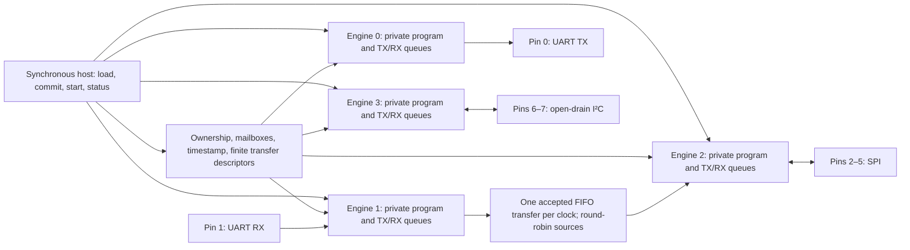

# Four-engine architecture

This describes the ISA2 design generated from `hardcaml/`. It was copied from
the author's asic-lab monorepo (`projects/protocol-emulator/docs/architecture.md`,
eb6b17c). The design has not completed physical signoff.

The processor runs four instruction streams concurrently. Each engine reads its
own writable program store and controls its own registered outputs. Sharing the
host port or FIFO mover therefore does not arbitrate instruction fetch or insert
cycles into an issued timed transfer. The initial configuration uses 32-bit data,
64 instructions per engine and eight words in each transmit/receive queue.

Every engine contains transmit and receive shifters, two scratch registers, a
16-bit repeat counter, a 24-bit interval/wait limit, and local control state.
The 32-bit instruction encoding is independent of the chosen data width. The
common 32-bit timestamp is sampled with `TIME`; it is a system-clock counter,
not an external time reference. The [ISA](isa.md) defines every instruction and
host acceptance edge.

## Where timing is committed

`WAIT` consumes one issue edge and the declared additional interval. In fused
configurations, `XFER` commits a bit count, half-period, clock mode, bit order,
and drive/sample selection before its first transition. It performs no queue
access during the transfer. Its pin transitions remain equally spaced even if
the host or another engine saturates a queue. Scalar firmware expresses timing
through instruction costs and waits. Prefetch must preserve these architectural
cycle costs; it is an implementation alternative, not a faster ISA mode.

Queue instructions are explicit stall points. Empty `PULL` and full blocking `PUSH` hold
the current instruction and data; they do not consume or overwrite a word.
Strict `PUSH a=1` instead traps on a full receive queue, retaining the rejected
word and PC and latching fault4. UART receive and SPI target receive firmware
use this mode. The debugger can read the held word after draining accepted data.
`WAITPIN` and `WAITEVENT` have a programmable timeout and sticky fault reporting.
Input synchronization adds sampling latency: all protocol inputs pass through
two flip-flops. This is relevant to SPI return data, target modes and external
edge detection. No simulated cycle count establishes a physical maximum rate.

## Autonomy and congestion

There is one transfer descriptor per source engine. A descriptor selects a
destination TX queue and a finite word quota. An accepted move pops one source
RX word, pushes the same destination TX word and decrements the quota together.
The cursor advances after an accepted move. Continuously eligible sources are
served within at most four accepted grants in the four-engine machine.

That grant bound is conditional on eligibility. A full destination, a partial
host read reserving the source, or repeated host writes taking destination
priority can prevent eligibility indefinitely. These conditions cannot lengthen
a committed `XFER`; they can delay the next `PULL` or `PUSH`. The host must
release its read reservation for a bridge to progress.

The congestion regression fills both queues, holds a blocked `PUSH` beyond its
ordinary pin/event limit, then drains the route and checks exact word order and
finite quota while unrelated pin streams retain their periods. It establishes
conservation of accepted words. It does not establish unlimited lossless UART
reception: UART has no backpressure wire in the eight-pin flagship, so an external
sender must respect the documented workload/capacity envelope. Native ISA1 replay
demonstrated an externally transmitted byte missed without a persistent fault.
ISA2's strict delivery reports overload before that condition can resume silently;
traffic arriving after the fault is not received. Sustained-rate claims must
include the source rate and host service policy. I²C targets keep blocking queue
operations at holding points that stretch SCL.

Mailboxes are pending bits, not counted queues of events. Repeated signals can
coalesce; simultaneous delivery and consumption leaves the event pending. Firmware
can wait for synchronized external inputs and signal another engine. In ISA2,
each engine also has one programmable rising/falling/high/low input detector.
It delivers to the mailbox independently during transfers, waits, queue stalls
and halt. Detection uses synchronized pins and does not claim asynchronous pulse
capture; pulses must satisfy the sampled-input contract. Ownership
is disjoint and can change only while halted; multiple engines may observe any
input. Reset, deselection, halt and faults release output enables. Open-drain
pins drive only low or release, with external pull-ups required.

## Fit and selection

The baseline has 8,192 program bits and 2,048 FIFO payload bits before datapath
and control state. A register program store does not fit a Tiny Tapeout 8x4
tile, so this chip uses the private instruction-SRAM refinement
(`configs/instruction-sram-32.json`): eight `RM_IHPSG13_1P_64x16_c2` macros
replace those program bits while keeping independent per-engine fetch and the
same issue timing. A 2–4 KiB shared payload/capture buffer would be a third,
unimplemented memory organization; private instruction SRAM does not provide
it. Area measurements and the 6x4 insurance options are in
[area-study.md](area-study.md); the macro integration and local hardening
evidence are in [hardening.md](hardening.md).
