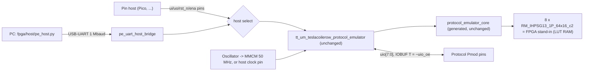

# FPGA prototype

This page covers the FPGA builds of the chip, for testing firmware and
peripherals on real pins before silicon exists. Two boards are supported: the
Digilent Cmod A7-35T and the Real Digital Urbana (the MIT 6.205 board).

The FPGA image contains the Tiny Tapeout top `tt_um_teslacoilerow_protocol_emulator`
and the Hardcaml-generated core, both unchanged. Around them are three
FPGA-only additions:

- a board wrapper (pads, clocking, reset, LEDs);
- a replacement for the IHP SRAM macro, proved cycle-equivalent to the IHP model;
- a USB-UART bridge, so a PC can act as the host with no extra hardware.

**Status (2026-09-25).** Bitstreams exist for both boards (open-source openXC7
flow). They have been checked in simulation and formal verification only. No
board has been programmed yet, so nothing on this page is a hardware
observation. The "Verification" section lists what was run and where.

Start with these bitstreams:

- **Cmod A7**: `pe_cmod_a7_pll50_bridgeonly.bit` (PC over USB, 50 MHz) or
  `pe_cmod_a7_host.bit` (Pico clocks the design).
- **Urbana**: `pe_urbana_pll50.bit` or `pe_urbana_host.bit`.

All four meet 50 MHz in nextpnr's timing model. See "Build results".

## Contents of the FPGA image



| Block | File | Notes |
|---|---|---|
| Board top | `fpga/rtl/pe_top_cmod_a7.v`, `fpga/rtl/pe_top_urbana.v` | Pads, clock source, straps/switches, LEDs |
| Shell | `fpga/rtl/pe_fpga_shell.v` | TT top instance; reset synchroniser; host-select mux; UART bridge; status |
| UART bridge | `fpga/rtl/pe_uart_host_bridge.v` | PC ↔ nibble host port, in the core clock domain |
| Clocking | `fpga/rtl/pe_fpga_clkgen.v`, `fpga/rtl/pe_fpga_clkfwd.v` | MMCME2_ADV or BUFG; ODDR clock forwarding |
| SRAM stand-in | `fpga/rtl/pe_fpga_sram_64x16.v`, `fpga/rtl/RM_IHPSG13_1P_64x16_c2_fpga.v` | Same module name and ports as the IHP macro |

**Fidelity to the chip.**

- `ui_in`, `uo_out`, `rst_n` and `ena` connect to the TT ports with no added
  registers or synchronisers. The combinational window-change bubble on
  `uo_out` (docs/isa.md) therefore appears on the pins exactly as it would on
  silicon.
- The protocol pins go to IOBUFs with `T = ~uio_oe`, `I = uio_out` and
  `O = uio_in`. The core's own two-flop input synchronisers are the only ones.
- Open-drain (I²C) needs no special pad. The core already drives
  `uio_out = 0` with `uio_oe = logical OE AND NOT value` (docs/isa.md), and
  the IOBUF passes that through.
- Each protocol pin has the FPGA's weak internal pull-up (`PULLTYPE PULLUP`), so
  a released pin reads high. The pull-up is weak, so fit real 2.2–4.7 kΩ
  pull-ups on I²C lines.

### SRAM stand-in

The core instantiates eight `RM_IHPSG13_1P_64x16_c2` macros, two per engine,
to hold its instruction memory. It ties `A_DLY` high and drives:

- `A_MEN = ~clear`;
- `A_WEN` for host program writes;
- `A_REN = ~A_WEN`.

It reads the next instruction every cycle.

The IHP behavioral model (`models/RM_IHPSG13_1P_core_behavioral.v`, used
with `FUNCTIONAL`) behaves as follows on each rising edge with `A_MEN` high:

| `A_WEN` | `A_REN` | Memory | `A_DOUT` |
|---|---|---|---|
| 1 | 1 | written | the written data (write-through) |
| 1 | 0 | written | holds |
| 0 | 1 | unchanged | the stored word, registered |

When `A_MEN` is low, nothing changes.

`fpga/rtl/pe_fpga_sram_64x16.v` implements exactly this. The array is
asynchronous-read LUT RAM; Yosys maps it to 16 `RAM64X1S` per macro. The output
is a separate fabric register with clock enable, followed by a 2:1 mux for
write-through. A 7-series block RAM was not used because its output register
cannot provide "write without read holds `A_DOUT`" together with write-through:
in `WRITE_FIRST` mode the output also updates on writes where `A_REN` is low.

There is one difference, and the core cannot see it. The FPGA powers up with
zeros in the array and output register, while the macro's contents are
unknown (X in the model). COMMIT only accepts a fully written image, and
execution is bounded by the committed length, so no unwritten word is ever
executed.

`fpga/rtl/RM_IHPSG13_1P_64x16_c2_fpga.v` gives the stand-in the macro's
module name and ports, so the FPGA build uses the generated core file as it
is.

The equivalence is proved formally (`fpga/formal/`, see "Verification").

## Builds

| Build | Core clock | Host | Bitstream |
|---|---|---|---|
| `cmod_a7 pll50` | 12 MHz oscillator → MMCM (×50 ÷12, VCO 600 MHz) → 50 MHz | UART bridge (default) or DIP pin host synchronous to `host_clk` (output) | `pe_cmod_a7_pll50.bit` |
| `cmod_a7 pll50`, `BRIDGE_ONLY=1` | as above | UART bridge only (DIP host pins unused) | `pe_cmod_a7_pll50_bridgeonly.bit` |
| `cmod_a7 pll40` | 12 MHz oscillator → MMCM (×50 ÷15, VCO 600 MHz) → 40 MHz | as `pll50` | `pe_cmod_a7_pll40.bit` |
| `cmod_a7 osc12` | 12 MHz oscillator directly (no MMCM) | as `pll50` | `pe_cmod_a7_osc12.bit` |
| `cmod_a7 host` | `host_clk` pin, driven by the host | DIP pin host only | `pe_cmod_a7_host.bit` |
| `urbana pll50` | 100 MHz oscillator → MMCM (×10 ÷20, VCO 1000 MHz) → 50 MHz | UART bridge (sw[0] down) or Pmod pin host (sw[0] up) | `pe_urbana_pll50.bit` |
| `urbana pll40` | MMCM ×10 ÷25 → 40 MHz (option, not built) | as `urbana pll50` | – |
| `urbana host` | `host_clk` pin (JAB_1) | Pmod pin host only | `pe_urbana_host.bit` |

The firmware images count clocks, so every protocol rate scales with the core
clock. UART at 64 clocks per bit, for example, is 781.25 kbaud at 50 MHz,
625 kbaud at 40 MHz and 187.5 kbaud at 12 MHz. With a host clock, the rate is
whatever the host provides. The UART bridge runs at 1 Mbaud in every build:
its divider is 50, 40 or 12 clocks per bit.

`osc12` avoids the MMCM entirely. It is the fallback if the MMCM output does
not come up on real hardware: openXC7's MMCM support is recent (see
"Toolchain").

`pe_host.py info` reports the build and measures the core clock against the
PC clock.

### Build results

All bitstreams were built on MIT Engaging through Slurm on 2026-09-25, from
this tree with the openXC7 2026-09-24 toolchain. The table comes from each
build's `summary.json`.

- **fmax** is nextpnr-xilinx's post-route estimate for the core clock `clk`,
  using prjxray's -1 timing data. It is not a Vivado sign-off.
- **Runs** are independent HeAP-placer seeds; the fastest is kept.
- **LUT cells** are nextpnr's placed LUT bels, which include LUT RAM and
  route-through LUTs. Percentages are against the part's datasheet capacity:
  20,800 LUTs and 41,600 FFs for the xc7a35t; 32,600 and 65,200 for the
  xc7s50.
- No block RAM and no DSP are used. The eight SRAM stand-ins take
  128 RAM64X1S. The core's other small memories take 48 RAM32M and 6 RAM64M
  (Yosys cell counts).

| Build | Job | fmax, best run | Target | Runs: fmax range (MHz) | LUT cells | FFs | CARRY4 | LUT RAM cells | IO pads | MMCM |
|---|---|---|---|---|---|---|---|---|---|---|
| `cmod_a7 pll50` + `BRIDGE_ONLY=1` | 23760777 | **55.82 MHz, met** | 50 MHz | 16: 44.41–55.82 | 9,687 (46.6%) | 2,469 (5.9%) | 316 | 182 | 38 | 1 |
| `cmod_a7 pll50` | 23760779 | **46.39 MHz, not met** | 50 MHz | 16: 40.09–46.39 | 9,797 (47.1%) | 2,471 (5.9%) | 320 | 182 | 38 | 1 |
| `cmod_a7 pll40` | 23763553 | 50.83 MHz, met | 40 MHz | 16: 44.16–50.83 | 9,720 (46.7%) | 2,471 (5.9%) | 319 | 182 | 38 | 1 |
| `cmod_a7 osc12` | 23760781 | 46.20 MHz, met | 12 MHz | 8: 41.95–46.20 | 9,749 (46.9%) | 2,471 (5.9%) | 320 | 182 | 38 | 0 |
| `cmod_a7 host` | 23763555 | 51.42 MHz, met | 50 MHz | 16: 43.86–51.42 | 8,715 (41.9%) | 2,030 (4.9%) | 260 | 176 | 38 | 0 |
| `urbana pll50` | 23760780 | 54.35 MHz, met | 50 MHz | 16: 45.17–54.35 | 9,829 (30.2%) | 2,471 (3.8%) | 322 | 182 | 63 | 1 |
| `urbana host` | 23763558 | 61.92 MHz, met | 50 MHz | 16: 51.46–61.92 | 8,756 (26.9%) | 2,030 (3.1%) | 259 | 176 | 63 | 0 |

**Timing findings.**

- In the Cmod A7 `pll50` runs inspected, the critical path is inside the core.
  It runs from the host-selected-engine register through 12–13 LUT levels to a
  clock enable: about 1.7 ns of logic and 19–21 ns of routing.
- On the Cmod A7, a `pll50` build that keeps the DIP pin-host port misses
  50 MHz for every seed; the best run is 46.39 MHz. Leaving the DIP host pins
  unused (`BRIDGE_ONLY=1`) raises the best run to 55.82 MHz. The likely reason
  is that those pins are spread over three I/O banks (16, 34 and 35) and pull
  the placement apart; this was not analysed further.
- The recommended Cmod A7 bitstreams are:
  - `pe_cmod_a7_pll50_bridgeonly.bit` for the PC over USB at 50 MHz;
  - `pe_cmod_a7_host.bit` for a Pico or other host-clocked pin host;
  - `pe_cmod_a7_pll40.bit` for a pin host synchronous to a forwarded 40 MHz
    clock.
- `pe_cmod_a7_pll50.bit` is kept for completeness. nextpnr's model says it
  does not meet 50 MHz.
- The Urbana builds meet 50 MHz with their pin host included.
- The simulated-annealing placer (`sa`) was also tried on the Cmod `pll50`
  build (job 23757415) and was much worse: 31–34 MHz.

**Bitstreams.** They are stored with their summaries and readback reports in
`$PE_WORK/fpga/bitstreams/` (not in git).

Rebuilding a configuration reproduces the same placement and fmax. The only
difference is the build time in the `.bit` header. Two rebuilds of
`urbana host` (jobs 23767384 and 23768209) differed from the recorded file in
3 and 4 header bytes, and job 23768209 read back the same 403,931
configuration bits. Compare configuration data, not file hashes, when
checking a rebuild. Job 23768209 also ran the final `build.sh` end to end,
including its readback step.

| File | Bytes | SHA-256 |
|---|---|---|
| `pe_cmod_a7_pll50_bridgeonly.bit` | 2,192,137 | `b698acd0ae0d5cab7d4e16e4dea39945c7c36098e7b266cd46fe83f067dd1c26` |
| `pe_cmod_a7_pll50.bit` | 2,192,126 | `96e54c9792686bad3bb971f4a24393b82e6cef0ba7a025bc85b51f84b652a380` |
| `pe_cmod_a7_pll40.bit` | 2,192,126 | `b4c2371fe358ac3fa6038a6b03a7b486c13f8cd143168c6f7e213c7aa5a1205c` |
| `pe_cmod_a7_osc12.bit` | 2,192,126 | `a42b446a5b4fa455771fd811da85e7a86c332e9a702c6cddae6010bedebc545e` |
| `pe_cmod_a7_host.bit` | 2,192,125 | `cd079c749b3680f6d0612ca892545a309f55af0713b913f86e8030ef9c604071` |
| `pe_urbana_pll50.bit` | 2,192,125 | `31c0300578721442565eebc2298cc32a3c3ef4e8a3b3217e238eaad78b7af16e` |
| `pe_urbana_host.bit` | 2,192,124 | `6489dd088f82318fb175cc07cb468c18f2d3757d5b57c56882f15adbaee851e1` |

**Readback.** `fpga/scripts/readback.sh` checks each bitstream at the bit
level (job 23767112, all 7 PASS):

- It decodes the `.bit` with prjxray's `bitread`.
- It compares the set bits with the frames `fasm2frames` produces from
  nextpnr's FASM.
- Each bitstream carries exactly those configuration bits, 0 missing and 0
  extra (for example 442,476 bits in 2,388 frames for the bridge-only Cmod
  build).
- `bitread` ignores the per-frame ECC word.

This checks bitstream assembly, not the FASM semantics.

The MMCM counter settings in the final FASM match the intended divisors:

| Build | DIVCLK | CLKFBOUT high/low | CLKOUT0 high/low |
|---|---|---|---|
| Urbana `pll50` | no-count (÷1) | 5/5 (×10) | 10/10 (÷20) |
| Cmod A7 `pll50` | no-count (÷1) | 25/25 (×50) | 6/6 (÷12) |
| Cmod A7 `pll40` | no-count (÷1) | 25/25 (×50) | 7/8 with EDGE (÷15) |

## Pin maps

### Digilent Cmod A7-35T

Source: Digilent's
[Cmod-A7-Master.xdc](https://github.com/Digilent/digilent-xdc/blob/master/Cmod-A7-Master.xdc).
The constraints are in `fpga/constraints/cmod_a7_35t.xdc`. All I/O is
LVCMOS33, and the board runs from USB. "DIP n" is pin n of the 48-pin DIP
header. Pin 24 is VU (USB 5 V) and pin 25 is GND.

Protocol pins on Pmod JA (pins 5 and 11 are GND, 6 and 12 are 3.3 V):

| Signal | Pmod JA pin | FPGA pin |
|---|---|---|
| uio[0] | 1 | G17 |
| uio[1] | 2 | G19 |
| uio[2] | 3 | N18 |
| uio[3] | 4 | L18 |
| uio[4] | 7 | H17 |
| uio[5] | 8 | H19 |
| uio[6] | 9 | J19 |
| uio[7] | 10 | K18 |

Host port on the DIP header:

| Signal | DIP pins | FPGA pins |
|---|---|---|
| ui_in[0..7] (host → chip) | 1, 2, 3, 4, 5, 6, 7, 8 | M3, L3, A16, K3, C15, H1, A15, B15 |
| uo_out[0..7] (chip → host) | 9, 10, 11, 12, 13, 14, 17, 18 | A14, J3, J1, K2, L1, L2, M1, N3 |
| host select (in, pull-up): open = UART bridge, GND = pin host | 45 | U7 |
| host_clk: output (pll50/osc12) or input (host build) | 46 | W7 (MRCC, clock capable) |
| rst_n from the pin host (in, pull-up) | 47 | U8 |
| ena from the pin host (in, pull-up) | 48 | V8 |

`ui_in` bit meanings are from docs/isa.md:

- ui[3:0]: write nibble
- ui[4]: write-valid
- ui[5]: read-ready
- ui[7:6]: window

`uo_out` bit meanings:

- uo[3:0]: read nibble
- uo[4]: write-ready
- uo[5]: read-valid
- uo[6]: event/IRQ
- uo[7]: fault

Board I/O:

- USB-UART (FTDI): J17 is FTDI → FPGA, J18 is FPGA → FTDI. It appears as the
  second serial port of the board's USB device.
- btn[0] (A18) resets the board logic and the core.
- led[0] is a heartbeat (about 0.75 Hz at 50 MHz); led[1] is event/IRQ (uo[6]).
- The RGB LED is active low: red = fault (uo[7]), green = UART traffic,
  blue = pin host selected.

### Real Digital Urbana

Sources:

- Real Digital's `urbana.xdc` ([board page](https://www.realdigital.org/hardware/urbana));
- the MIT 6.205
  [top_level.xdc](https://fpga.mit.edu/6205/_static/F25/default_files/week07/top_level.xdc);
- the Urbana schematic, sheet 5 (PMOD HEADERS).

Constraints are in `fpga/constraints/urbana_xc7s50.xdc`. The official XDC
repeats JA2's pins (H13/H14) for JB2. The 6.205 file corrects this to
K14/J15 (IO_L23P/N_T3_15), and that correction is used here.

Everything goes through the 30-pin Pmod+ header J1. Its pin numbering runs
counter-clockwise: J1.1–15 along one row, J1.16–30 back along the other.

- PMOD A takes J1.1–6 and J1.25–30.
- PMOD B takes J1.10–15 and J1.16–21.
- Six GPIO (JAB_0–5) sit in the middle, J1.7–9 and J1.22–24.
- GND is J1.5, 14, 17 and 26; 3.3 V is J1.6, 15, 16 and 25.

Each signal has a 200 Ω series resistor on the board.

| Signal | Connector pin | J1 pin | FPGA pin |
|---|---|---|---|
| uio[0] | PMOD A 1 | 1 | F14 |
| uio[1] | PMOD A 2 | 2 | F15 |
| uio[2] | PMOD A 3 | 3 | H13 |
| uio[3] | PMOD A 4 | 4 | H14 |
| uio[4] | PMOD A 7 | 30 | J13 |
| uio[5] | PMOD A 8 | 29 | J14 |
| uio[6] | PMOD A 9 | 28 | E14 |
| uio[7] | PMOD A 10 | 27 | E15 |
| ui_in[0..3] | PMOD B 1, 2, 3, 4 | 10, 11, 12, 13 | H18, G18, K14, J15 |
| ui_in[4..7] | PMOD B 7, 8, 9, 10 | 21, 20, 19, 18 | H16, H17, K16, J16 |
| uo_out[0] | JAB_0 | 7 | D11 |
| host_clk: output (pll50) or input (host build) | JAB_1 | 8 | C12 (MRCC, clock capable) |
| uo_out[1] | JAB_2 | 9 | E16 |
| uo_out[2] | JAB_3 | 22 | G16 |
| uo_out[3] | JAB_4 | 23 | C11 |
| uo_out[4] (write-ready) | JAB_5 | 24 | D10 |
| uo_out[5] (read-valid) | servo J4 signal (SERVO1) | – | L17 |
| host reset, active high (pull-down) | servo J3 signal (SERVO0) | – | L18 |

The Pmod+ header has 22 signals; the pin host needs 24. The two lowest-rate
host signals therefore use servo-header signal pins:

- read-valid (`uo_out[5]`), on SERVO1;
- the host's reset, on SERVO0 (active high).

These pins have a 510 Ω series resistor on the board, which is fine for
host-clocked rates. **Never connect the servo headers' middle pin: it carries
+5 V servo power.**

`uo_out[7:6]` (fault, event) are shown on LEDs only. They can also be read as
status over the host port.

Switches and LEDs:

- sw[0]: host select (down = UART bridge, up = pin host).
- sw[1]: up = deselect (`ena` low) while the pin host is selected.
- btn[0]: board reset.
- LED[0]: heartbeat
- LED[1]: event/IRQ
- LED[2]: fault
- LED[3]: pin host selected
- LED[4]: UART traffic
- LED[5]: clock locked
- LED[6]: some protocol pin driven
- LED[7]: core out of reset
- LED[15:8]: live levels of uio[0..7]

USB-UART (FTDI FT2232H channel B): B16 is FTDI → FPGA, A16 is FPGA → FTDI.
Switches and buttons are on the 2.5 V bank 35 (LVCMOS25); everything else is
LVCMOS33.

## Hosts

### PC over USB (UART bridge, pll50/pll40/osc12 builds)

`fpga/rtl/pe_uart_host_bridge.v` receives 8N1 at 1 Mbaud; the divider is an
exact integer at 50, 40 and 12 MHz. It performs the nibble handshakes of
docs/isa.md in the core clock domain. It drives `ui_in` from registers and
registers `uo_out` at every edge.

Each nibble takes two cycles:

1. Valid (or ready) is high for one edge.
2. The registered `uo_out` then shows whether the core accepted the nibble at
   that edge.

As a result, no bridge logic sits on the core's combinational `uo_out` paths.

Commands are a command byte plus a fixed payload, little endian. The file
header has the full table. In summary:

- `V`: identify the build.
- `S`: sample pins.
- `C`: read a free-running cycle counter.
- `L`: set the transfer timeout.
- `W`: write a word to window 0–2.
- `R`: read a word from window 0 or 3, optionally after a window bounce for a
  fresh status snapshot.
- `X`: hold `rst_n` low for n clocks.
- `N`: drive `ena`.

A stalled transfer times out, 20 ms by default. The bridge then abandons it by
changing window and replies `T`.

`fpga/host/pe_host.py` needs Python 3 and pyserial. It is the PC side, with
the same operations as `test/harness.py`: `command`, `status`, `load`,
`load_firmware` (with the SHA-256 identity checks), `push_tx`, `pop_rx`,
`route`, `engine_status`.

The CLI commands are `info`, `selftest`, `loopback`, `load NAME`, `status` and
`reset`. The same code runs against the simulated board in
`fpga/sim/test_fpga_bridge.py`.

On Linux, the Cmod A7 and the Urbana each enumerate two serial ports. The
UART is normally the second one, e.g. `/dev/ttyUSB1`. The first one is JTAG.

### Pin host (Pico) and the host clock option

The Tiny Tapeout demo board lets its RP2040/RP2350 clock the project. The
`host` builds do the same: the core clock is the `host_clk` pin.
`fpga/host/pico_host.py` (MicroPython) drives one full cycle per call:

1. Set `ui_in`, `rst_n` and `ena` with the clock low.
2. Sample `uo_out`; this is the pre-edge value.
3. Pulse the clock.

This is the cycle discipline of `test/harness.py`. With plain `machine.Pin`
calls it reaches roughly a few thousand cycles per second (not measured), which is
enough to load programs and watch the protocol pins at a proportionally
scaled rate.

Wiring for a Pico and the Cmod A7 `host` build (all signals 3.3 V; the
`PicoPort()` defaults):

| Pico | Cmod A7 | Signal |
|---|---|---|
| GP0–GP7 | DIP 1–8 | ui_in[0..7] |
| GP8–GP15 | DIP 9–14, 17, 18 | uo_out[0..7] |
| GP16 | DIP 46 | host_clk |
| GP17 | DIP 47 | rst_n |
| GP18 | DIP 48 | ena (optional; pulled up on the FPGA) |
| GND | DIP 25 | common ground |

For the Urbana `host` build:

- **ui_in**: GP0–7 go to PMOD B pins 1–4 and 7–10.
- **uo_out**: GP8–12 read JAB_0, JAB_2, JAB_3, JAB_4 and JAB_5 (uo_out[0..4]),
  and GP13 reads the SERVO1 signal (uo_out[5]).
- **Clock and reset**: GP16 drives JAB_1 (host_clk); GP17 drives the SERVO0
  signal (reset, active high).
- **Switches**: set sw[0] up.
- **Driver setup**: `PicoPort(uo=(8, 9, 10, 11, 12, 13), rst_active_high=True, ena=None)`.

The `pll50` and `pll40` builds also accept a pin host. Select it with DIP 45
to GND (Cmod A7) or sw[0] up (Urbana). In those builds `host_clk` is an output
carrying the core clock, for a host fast enough to be synchronous to it.
Examples are another FPGA or a logic-analyser pattern generator; a Pico cannot
keep up. On the Cmod A7, use `pll40` for this: the `pll50` build with the DIP
pin host misses 50 MHz in nextpnr's timing model (see "Build results").

## Toolchain

Earlier Cmod A7 work in the monorepo (`projects/protocol-emulator/fpga/`,
`tools/fpga-*.sbatch`, `docs/fpga.md`) used openXC7 packages 0.9.3/0.9.4 and
later a locally patched nextpnr-xilinx. It hit timing-reconstruction
assertions and constant-net holdouts, and ran at 12 MHz. Those packages are
still at
`<cluster scratch>/protocol-emulator/fpga-implementation-toolchain*`.
The chipdbs there match their own releases only.

This flow uses a newer upstream release, with no local patches:
[FPGAwars tools-openxc7](https://github.com/FPGAwars/tools-openxc7) release
`2026-09-24`.

- It contains nextpnr-xilinx `0eae9fbb19`, prjxray-db, fasm2frames and
  xc7frames2bit.
- The chipdb assets for `xc7a35tcpg236` and `xc7s50csga324` come from the same
  release. A chipdb only works with the package of the same tag.
- Synthesis is Yosys 0.67 from OSS CAD Suite `20260729`.
- On the cluster it is unpacked at
  `$PE_WORK/fpga/toolchain/openxc7-20260924`.
- The openXC7 chipdb for the xc7a35t is the xc7a50t die; the two parts are the
  same silicon. nextpnr's "available" counts are therefore the 50T's.

To reproduce the toolchain elsewhere:

```sh
gh release download 2026-09-24 -R FPGAwars/tools-openxc7 \
  -p 'apio-openxc7-linux-x86-64-20260924.tgz' \
  -p 'apio-xilinx-chipdb-xc7a35tcpg236-20260924.bin.tgz' \
  -p 'apio-xilinx-chipdb-xc7s50csga324-20260924.bin.tgz' -p SHA256SUMS
grep -E 'linux-x86-64|xc7a35tcpg236|xc7s50csga324' SHA256SUMS | sha256sum -c
mkdir openxc7 && tar xzf apio-openxc7-linux-x86-64-20260924.tgz -C openxc7
tar xzf apio-xilinx-chipdb-xc7a35tcpg236-20260924.bin.tgz -C openxc7/chipdb
tar xzf apio-xilinx-chipdb-xc7s50csga324-20260924.bin.tgz -C openxc7/chipdb
export OPENXC7=$PWD/openxc7
```

To build (Yosys on `PATH`):

```sh
fpga/scripts/build.sh cmod_a7 pll50 build/cmod_a7_pll50 heap:1 heap:2 heap:3 heap:4 heap:5 heap:6 heap:7 heap:8
```

The flow has three steps:

1. **Synthesis**: `synth_xilinx -flatten -abc9`.
2. **Place and route**: each `PLACER:SEED` run is a nextpnr-xilinx call with
   `--freq 50 --timing-allow-fail`, and the runs go in parallel. The run with
   the highest fmax for the core clock goes through `fasm2frames` and
   `xc7frames2bit`.
3. **Outputs**: `summary.json` (utilisation, fmax of every run, bitstream
   SHA-256), the synthesized netlist `synth_netlist.v`, the exact inputs
   under `src/`, and `readback.json`. The last comes from
   `fpga/scripts/readback.sh`, which build.sh runs after bit generation. The
   recorded builds ran it as a separate job, 23767112.

`fasm2frames` prints a file-locking warning on stdout on some network
filesystems. The script keeps only the frame lines, because a polluted frames
file makes `xc7frames2bit` abort.

On Engaging:

```sh
sbatch -p mit_quicktest --time=00:15:00 -J pe-x-fpga-build-final-cmod_a7-pll50 \
  $PE_WORK/fpga/jobs/build_all.sbatch \
  "BRIDGE_ONLY=1 cmod_a7 pll50 $(echo heap:{1..16})"
```

`build_all.sbatch` (16 CPUs) takes one or more `"[VAR=1] BOARD CLOCK RUNS..."`
configurations. It runs them one after another, with the place-and-route runs
of each in parallel. A 16-seed configuration takes 6–9 minutes, so use one
configuration per `mit_quicktest` job.

```sh
# a quick end-to-end check: two seeds
sbatch -p mit_quicktest --time=00:15:00 -c 2 --mem=8G -J pe-x-fpga-build-check \
  $PE_WORK/fpga/jobs/build_all.sbatch "urbana host heap:8 heap:1"
```

## Programming

[openFPGALoader](https://github.com/trabucayre/openFPGALoader) writes to the
FPGA's configuration SRAM, so the image is lost at power-off:

```sh
openFPGALoader -b cmoda7_35t pe_cmod_a7_pll50_bridgeonly.bit
openFPGALoader -b arty_s7_50 pe_urbana_pll50.bit
```

The Urbana's USB-JTAG is an FT2232H channel A, like Digilent boards. 6.205
documents `-b arty_s7_50` for Urbana bitstreams
([6.205 openFPGA page](https://fpga.mit.edu/6205/F24/documentation/openFPGA)).
Add `-f` to write the SPI flash instead, which survives power cycles.
openFPGALoader loads its own SPI bridge for that.

On Linux, install the udev rules from the openFPGALoader repository, or run
it as root, before first use.

## Hardware test procedure

Each step lists what to connect, the command to run and what a pass looks
like. The messages quoted below are the ones `pe_host.py` prints.
`fpga/sim/test_fpga_bridge.py` runs the same `selftest` and `loopback` code
against the simulated board, and it passes (job ids in "Verification"). On
hardware, only the measured clock and the timestamp numbers should differ.

### 1. Bring-up, nothing connected (UART bridge, pll50 build)

Connect only the USB cable, and leave the protocol Pmod empty. On the Urbana,
all switches must be down.

```sh
openFPGALoader -b cmoda7_35t pe_cmod_a7_pll50_bridgeonly.bit   # or: -b arty_s7_50 pe_urbana_pll50.bit
python3 fpga/host/pe_host.py --port /dev/ttyUSB1 info
python3 fpga/host/pe_host.py --port /dev/ttyUSB1 selftest
```

**Pass criteria:**

- The heartbeat LED blinks.
- `info` prints
  `bridge: bridge protocol 1, board Cmod A7-35T, clock pll50 (MMCM, board oscillator), 50 MHz, 1 Mbaud`,
  followed by `core clock: 50.0xx MHz measured ...` and `ISA version 2`.
  A measured clock far from 50 MHz means the MMCM is not doing what it
  should; try `pe_cmod_a7_osc12.bit`, whose `info` must report 12 MHz.
- `selftest` ends with `SELFTEST PASS`. It checks:
  - the ISA version;
  - all four engines idle after reset;
  - that the core timestamp advances at exactly the bridge's cycle rate;
  - that all eight pads drive `a5`/`5a` and read back;
  - that released pads read `ff` through the pull-ups;
  - that an open-drain pin pulls low and releases.

**If it fails:**

- **No reply at all**: wrong serial port, bitstream or baud rate.
- **Released pads not `ff`**: something is connected to the Pmod.

### 2. Loopback, two jumper wires

Fit two jumpers on the protocol Pmod:

- uio[0] ↔ uio[1]: Cmod JA pin 1 ↔ 2, or Urbana PMOD A pin 1 ↔ 2.
- uio[3] ↔ uio[4]: Cmod JA pin 4 ↔ 7, or Urbana PMOD A pin 4 ↔ 7.

Then run:

```sh
python3 fpga/host/pe_host.py --port /dev/ttyUSB1 loopback
```

The test runs this chain:

1. `uart-tx` on engine 0 sends `FPGA OK!` at 781.25 kbaud on pin 0.
2. `uart-rx` on engine 1 receives it on pin 1.
3. The autonomous route forwards each byte to engine 2's TX FIFO, with no
   host involvement.
4. `spi-controller-mode0` shifts the bytes out on MOSI (pin 3) and reads MISO
   (pin 4) through the jumper.

**Pass:** `engine 2 received b'FPGA OK!' over SPI`, then `LOOPBACK PASS`.
The UART receiver ends with its bounded idle timeout (fault 3) after the last
byte; the test expects that. Without the jumpers the test fails, and
`fpga/sim` checks that it does.

### 3. Real peripherals

Load the firmware for each engine with
`pe_host.py --port ... load <name>` (see `firmware/`). Then wire the
peripherals as in `firmware/flagship-scenario.json` (`pin_connections`):

- pin 0: UART TX
- pin 1: UART RX
- pins 2–5: SPI SCK, MOSI, MISO and CS
- pins 6–7: I²C SCL and SDA, with 4.7 kΩ pull-ups to 3.3 V

For bench runs, use `pe_host.Chip` from Python in the order of
`test/scenarios.py`:

1. Load the images.
2. `push_tx`.
3. `route`.
4. `command(START, mask)`.
5. `pop_rx`.

Capture the pins with a logic analyser and decode them with its UART, SPI and
I²C decoders.

### 4. Pico host (host-clock build)

Program `pe_cmod_a7_host.bit` and wire the Pico as in "Pin host". Copy
`fpga/host/pico_host.py` and the three image JSON files to the Pico. Then run:

```python
import json, pico_host
imgs = {n: json.load(open(n + ".image.json")) for n in ("uart-tx", "uart-rx", "spi-controller-mode0")}
host = pico_host.NibbleHost(pico_host.PicoPort())
host.reset(); print(host.status(pico_host.RS_VERSION))    # 2
pico_host.loopback(host, imgs)                             # jumpers as in step 2
```

**Pass:** `2`, then `LOOPBACK PASS`. The UART runs at the Pico's clock rate
divided by 64.

## Verification

Everything below ran on MIT Engaging through Slurm on 2026-09-25.

- Job ids and results are in
  `$PE_WORK/fpga/manifest.json`, and logs are
  under `.../tt-work/fpga/logs/`.
- The simulations used this tree's `src/` and `fpga/`.
- They took `test/` and `firmware/` from a `git archive` of commit 73536f0
  (`PE_TEST_DIR`, `PE_FIRMWARE_DIR`), because those directories were being
  edited in parallel.
- Tools: cocotb 2.0.1, Icarus Verilog 14, Yosys 0.67, SymbiYosys.

**SRAM stand-in ≡ IHP model** (`fpga/formal/run.sh`, `sram_equiv.sby`,
`sram_equiv_miter.sv`).

Inputs, SHA-256:

- `pe_fpga_sram_64x16.v`: `10d1d068…`
- `RM_IHPSG13_1P_core_behavioral.v`: `5aa61ac4…`

The miter drives both memories with free inputs every cycle. It compares
`A_DOUT` whenever the IHP model's output is defined by the history: last
loaded from a written address, or by write-through. The IHP model's power-up
state is left free.

| Task | Engine | Checks | Result | Job |
|---|---|---|---|---|
| `rtl_prove` | ABC PDR, unbounded | FPGA RTL ≡ `SRAM_1P_behavioral #(16,6)` | PASS | 23756607 |
| `netlist_prove` | ABC PDR, unbounded | the `synth_xilinx` netlist (16 RAM64X1S, 16 FDRE, 17 LUTs) with Yosys' Xilinx cell models ≡ IHP model | PASS | 23756607 |
| `rtl_bmc`, `netlist_bmc` | ABC bmc3, depth 24 / 12 | same property, second engine | PASS, PASS | 23756608 |
| `rtl_cover` | smtbmc (yices) | write-through, write-hold, registered read and `men`-low hold each reached with the checked output | PASS | 23756607 |
| mutants | ABC bmc3, depth 8 | four wrong models must fail: write updates dout (block-RAM `WRITE_FIRST`), read-first write-through, dout not held, `men` ignored | all 4 killed | 23756607 |
| `rtl_smt` | smtbmc (yices), depth 12 | third engine | no failure through step 10; still in step 11 after 25 min when this was written (the SMT array encoding is slow here; PDR above is the unbounded result) | 23760933 |

The `netlist_prove` result covers the SRAM module synthesized on its own.
Inside the full design, the same mapping is covered by the post-synthesis
simulations below.

**Full FPGA top, RTL simulation.** `fpga/sim/tb_fpga_pins.v` gives the board
top the Tiny Tapeout port names. The unchanged `test/` suite then checks the
FPGA prototype against the Python reference model every cycle:

- lockstep outputs;
- protocol peers and scoreboards.

The FPGA prototype here means the board top, shell, TT top, core and FPGA
SRAM, connected only through the board's pads.

The testbench also checks the pads on every cycle:

- each pad equals `uio_out` when driven, and the environment otherwise;
- the core sees the pad;
- the `uo_out` pins equal the core's.

A violation ends the run with `$fatal`, which fails the test. The final run
(job 23763625) used the final tree:

| Configuration | Suite | Result |
|---|---|---|
| Cmod A7, `host` build | smoke, protocols, flagship, 25 legacy replays, random lockstep | 39/39 PASS |
| Urbana, `host` build | same | 39/39 PASS |
| Cmod A7, `pll50` build, pin-host mode | same | 39/39 PASS |
| Urbana, `pll50` build, pin-host mode | same | 39/39 PASS |
| Cmod A7 and Urbana `pll50`, UART bridge driven by `pe_host.py` (`test_fpga_bridge.py`) | `info`/50 MHz cycle counter, `selftest`, `loopback`, loopback without jumpers must fail, error replies / timeout / host-select refusal | 5/5 PASS each |
| Cmod A7 `pll50` + `BRIDGE_ONLY=1` (job 23764155) | the same bridge tests | 5/5 PASS |
| Cmod A7 and Urbana `host`, Pico driver (`test_fpga_pico.py`; final `pico_host.py`, job 23768231) | host-clocked version check, idle engines, jumper loopback | 1/1 PASS each |
| Pico driver vs reference model (`fpga/host/test_pico_host.py`, job 23768231) | loopback with jumpers passes; without jumpers it fails | PASS |
| Checker self-test: pad 1 shorted to ground (`-DPE_TB_INJECT_PAD_FAULT`) | `test_smoke` | fails as required (`PAD ERROR pin 1 … $fatal`) |

**Post-synthesis simulation.** The `synth_xilinx` netlists of the two `host`
builds were simulated with Yosys' `cells_sim.v` under the same testbench and
the full suite (job 23757655):

- Cmod A7: 39/39 PASS in 577 s.
- Urbana: 39/39 PASS in 540 s.

These are the flattened netlists written by the same synthesis run as the
bitstream (`synth_netlist.v`). The final builds' netlists are byte-identical
to the ones simulated.

Summary of what is and is not covered:

- **Covered:**
  - equivalence of the SRAM replacement;
  - the unchanged `test/` suite on the FPGA top in RTL and after synthesis;
  - the UART bridge and PC host tool;
  - the Pico driver;
  - bit-level bitstream assembly.
- **Not covered:**
  - place-and-route correctness beyond nextpnr's own checks;
  - the MMCM, which is not simulated;
  - I/O timing;
  - anything on hardware.

## Limitations and open items

- **No hardware observations yet.** MMCM lock, pad behaviour, the UART bridge
  at 1 Mbaud, openFPGALoader on the Urbana and the Pico host speed are all to
  be confirmed on the boards.
- **Timing figures come from nextpnr-xilinx's model** (prjxray timing data),
  not Vivado's.
  - The Cmod A7 `pll50` build with the DIP pin host misses 50 MHz in that
    model: best run 46.39 MHz.
  - No I/O timing is constrained. For a pin host, the margin that matters is
    the host's own setup/hold around `host_clk`, which is large at
    Pico-driven rates.
- **Urbana pin-host limits.** The Urbana pin host uses two servo-header pins
  and exposes only `uo_out[5:0]` on pins. For a fast synchronous external
  host, use the Cmod A7 `pll40` build (all sixteen host signals on the DIP
  header) or the UART bridge.
  - The servo pins' 510 Ω series resistor, and a 10 kΩ resistor of unknown
    direction, were read from the schematic's text. Check them with a meter
    before relying on those two pins.
  - The Urbana Pmod+ pin order (J1 counter-clockwise, JB2 = K14/J15) was
    derived from the schematic netlist and the 6.205 constraints file. It
    should be confirmed with a continuity check on the first board.
- **Post-synthesis simulation uses Yosys' Xilinx cell models**
  (`cells_sim.v`), not Xilinx's unisims.
- **The MMCM is not simulated.** Its settings stay within the datasheet
  limits noted in `pe_fpga_clkgen.v`, and the counter values in the final
  FASM match them (see "Build results").
