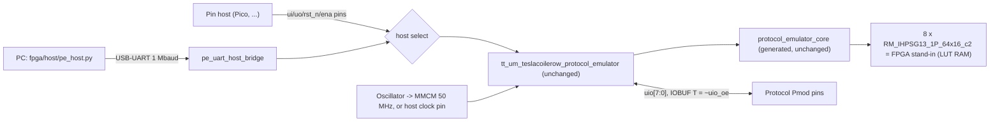

# FPGA prototype

This page covers the FPGA builds of the chip, for testing firmware and
peripherals on real pins before silicon exists. Two boards are supported: the
Digilent Cmod A7-35T and the Real Digital Urbana (the MIT 6.205 board).

The FPGA image contains the Tiny Tapeout top `tt_um_teslacoilerow_protocol_emulator`
and the Hardcaml-generated core, both unchanged. Around them are three
FPGA-only additions:

- a board wrapper (pads, clocking, reset, LEDs);
- a replacement for the IHP SRAM macro, proved cycle-equivalent to the IHP model;
- a USB-UART bridge, so a PC can act as the host with no extra hardware.

**Status (2026-09-26).** Bitstreams exist for both boards (open-source openXC7
flow). They have been checked in simulation and formal verification only. No
board has been programmed yet, so nothing on this page is a hardware
observation. The "Verification" section lists what was run and where.

Start with these bitstreams:

- **Cmod A7**: `pe_cmod_a7_pll50_bridgeonly.bit` or `pe_cmod_a7_pll50.bit`
  (PC over USB, 50 MHz), or `pe_cmod_a7_host.bit` (Pico clocks the design).
- **Urbana**: `pe_urbana_pll50.bit` or `pe_urbana_host.bit`.

All seven bitstreams meet their clock target in nextpnr's timing model; the
50 MHz builds reach 76–87 MHz there. See "Build results".

## Contents of the FPGA image



| Block | File | Notes |
|---|---|---|
| Board top | `fpga/rtl/pe_top_cmod_a7.v`, `fpga/rtl/pe_top_urbana.v` | Pads, clock source, straps/switches, LEDs |
| Shell | `fpga/rtl/pe_fpga_shell.v` | TT top instance; reset synchroniser; host-select mux; UART bridge; status |
| UART bridge | `fpga/rtl/pe_uart_host_bridge.v` | PC ↔ nibble host port, in the core clock domain |
| Clocking | `fpga/rtl/pe_fpga_clkgen.v`, `fpga/rtl/pe_fpga_clkfwd.v` | MMCME2_ADV or BUFG; ODDR clock forwarding |
| SRAM stand-in | `fpga/rtl/pe_fpga_sram_64x16.v`, `fpga/rtl/RM_IHPSG13_1P_64x16_c2_fpga.v` | Same module name and ports as the IHP macro |

**Fidelity to the chip.**

- `ui_in`, `uo_out`, `rst_n` and `ena` connect to the TT ports with no added
  registers or synchronisers. The combinational window-change bubble on
  `uo_out` (docs/isa.md) therefore appears on the pins exactly as it would on
  silicon.
- The protocol pins go to IOBUFs with `T = ~uio_oe`, `I = uio_out` and
  `O = uio_in`. The core's own two-flop input synchronisers are the only ones.
- Open-drain (I²C) needs no special pad. The core already drives
  `uio_out = 0` with `uio_oe = logical OE AND NOT value` (docs/isa.md), and
  the IOBUF passes that through.
- Each protocol pin has the FPGA's weak internal pull-up (`PULLTYPE PULLUP`), so
  a released pin reads high. The pull-up is weak, so fit real 2.2–4.7 kΩ
  pull-ups on I²C lines.

### SRAM stand-in

The core instantiates eight `RM_IHPSG13_1P_64x16_c2` macros, two per engine,
to hold its instruction memory. It ties `A_DLY` high and drives:

- `A_MEN = ~clear`;
- `A_WEN` for host program writes;
- `A_REN = ~A_WEN`.

It reads the next instruction every cycle.

The IHP behavioral model (`models/RM_IHPSG13_1P_core_behavioral.v`, used
with `FUNCTIONAL`) behaves as follows on each rising edge with `A_MEN` high:

| `A_WEN` | `A_REN` | Memory | `A_DOUT` |
|---|---|---|---|
| 1 | 1 | written | the written data (write-through) |
| 1 | 0 | written | holds |
| 0 | 1 | unchanged | the stored word, registered |

When `A_MEN` is low, nothing changes.

`fpga/rtl/pe_fpga_sram_64x16.v` implements exactly this. The array is
asynchronous-read LUT RAM; Yosys maps it to 16 `RAM64X1S` per macro. The output
is a separate fabric register with clock enable, followed by a 2:1 mux for
write-through. A 7-series block RAM was not used because its output register
cannot provide "write without read holds `A_DOUT`" together with write-through:
in `WRITE_FIRST` mode the output also updates on writes where `A_REN` is low.

There is one difference, and the core cannot see it. The FPGA powers up with
zeros in the array and output register, while the macro's contents are
unknown (X in the model). COMMIT only accepts a fully written image, and
execution is bounded by the committed length, so no unwritten word is ever
executed.

`fpga/rtl/RM_IHPSG13_1P_64x16_c2_fpga.v` gives the stand-in the macro's
module name and ports, so the FPGA build uses the generated core file as it
is.

The equivalence is proved formally (`fpga/formal/`, see "Verification").

## Builds

| Build | Core clock | Host | Bitstream |
|---|---|---|---|
| `cmod_a7 pll50` | 12 MHz oscillator → MMCM (×50 ÷12, VCO 600 MHz) → 50 MHz | UART bridge (default) or DIP pin host synchronous to `host_clk` (output) | `pe_cmod_a7_pll50.bit` |
| `cmod_a7 pll50`, `BRIDGE_ONLY=1` | as above | UART bridge only (DIP host pins unused) | `pe_cmod_a7_pll50_bridgeonly.bit` |
| `cmod_a7 pll40` | 12 MHz oscillator → MMCM (×50 ÷15, VCO 600 MHz) → 40 MHz | as `pll50` | `pe_cmod_a7_pll40.bit` |
| `cmod_a7 osc12` | 12 MHz oscillator directly (no MMCM) | as `pll50` | `pe_cmod_a7_osc12.bit` |
| `cmod_a7 host` | `host_clk` pin, driven by the host | DIP pin host only | `pe_cmod_a7_host.bit` |
| `urbana pll50` | 100 MHz oscillator → MMCM (×10 ÷20, VCO 1000 MHz) → 50 MHz | UART bridge (sw[0] down) or Pmod pin host (sw[0] up) | `pe_urbana_pll50.bit` |
| `urbana pll40` | MMCM ×10 ÷25 → 40 MHz (option, not built) | as `urbana pll50` | – |
| `urbana host` | `host_clk` pin (JAB_1) | Pmod pin host only | `pe_urbana_host.bit` |

The firmware images count clocks, so every protocol rate scales with the core
clock. UART at 64 clocks per bit, for example, is 781.25 kbaud at 50 MHz,
625 kbaud at 40 MHz and 187.5 kbaud at 12 MHz. With a host clock, the rate is
whatever the host provides. The UART bridge runs at 1 Mbaud in every build:
its divider is 50, 40 or 12 clocks per bit.

`osc12` avoids the MMCM entirely. It is the fallback if the MMCM output does
not come up on real hardware: openXC7's MMCM support is recent (see
"Toolchain").

`pe_host.py info` reports the build and measures the core clock against the
PC clock.

### Build results

The bitstreams below were built on MIT Engaging through Slurm on 2026-09-26
with the openXC7 2026-09-24 toolchain, from the design sources of commit
be7dbda (`src/` unchanged since 27ae5e1) and this `fpga/` tree.

- **fmax** is nextpnr-xilinx's post-route estimate for the core clock `clk`
  (its `--report`, for the finished design), using prjxray's -1 timing data.
  It is not a Vivado sign-off.
- **Options** are the `build.sh` options of each bitstream, recorded in
  `fpga/scripts/release.tsv`:
  - synthesis: ABC9 script `flow3mfs` with a 1000 ps wire delay
    (`ABC9_SCRIPT=flow3mfs ABC9_W=1000`), with or without `-nowidelut`
    (`SYNTH_OPTS`), whichever had the higher median fmax for that build in a
    first sweep of 32 seeds at each of the timing weights 80, 160 and 320
    (job 23993904);
  - placement: `TIMING_WEIGHT`, nextpnr's `placerHeap/timingWeight`;
  - routing: nextpnr's default `router2`, or `router1` (`ROUTER=router1`).
  See "Implementation study" for how these were found.
- **Placer seed** is the fastest run of the seed sweeps with the build's
  synthesis option set (repository sweep harness, `fpga/scripts/sweep/`;
  second table below). Each bitstream was rebuilt from scratch with
  `fpga/scripts/release.sh` (job 23998703): every rebuild gave the same fmax
  as its sweep run, and its `synth_netlist.v` is byte-identical to the
  netlist simulated under "Verification".
- **2026-09-25** is the fmax of the previous bitstream (default options, best
  of 8 or 16 seeds; build jobs 23760779, 23760777, 23763553, 23760781,
  23763555, 23760780 and 23763558 in table order, readback job 23767112).
- **LUT cells** are nextpnr's placed LUT bels, which include LUT RAM and
  route-through LUTs. Percentages are against the part's datasheet capacity:
  20,800 LUTs and 41,600 FFs for the xc7a35t; 32,600 and 65,200 for the
  xc7s50. Resource use is within 3 % of the 2026-09-25 builds.
- No block RAM and no DSP are used. The eight SRAM stand-ins take
  128 RAM64X1S; the core's other small memories take 48 RAM32M and 6 RAM64M
  (Yosys cell counts; "LUT RAM" counts these cells). The `pll50` and `pll40`
  builds use one MMCM.

| Build | Options | Placer seed | **fmax** | Target | 2026-09-25 | LUT cells | FFs | CARRY4 | LUT RAM | IO pads | Jobs (sweeps; build) |
|---|---|---|---|---|---|---|---|---|---|---|---|
| `cmod_a7 pll50` | `flow3mfs` W 1000, `-nowidelut`; timing weight 80; router1 | 41 | **79.69 MHz** | 50 MHz | 46.39 MHz | 9,777 (47.0%) | 2,471 (5.9%) | 318 | 182 | 38 | 23993904, 23994656, 23997747; 23998703 |
| `cmod_a7 pll50` + `BRIDGE_ONLY=1` | `flow3mfs` W 1000, `-nowidelut`; timing weight 80; router2 | 190 | **78.38 MHz** | 50 MHz | 55.82 MHz | 9,646 (46.4%) | 2,469 (5.9%) | 316 | 182 | 38 | 23993904, 23994656; 23998703 |
| `cmod_a7 pll40` | `flow3mfs` W 1000, `-nowidelut`; timing weight 160; router2 | 214 | **73.91 MHz** | 40 MHz | 50.83 MHz | 9,596 (46.1%) | 2,471 (5.9%) | 316 | 182 | 38 | 23993904, 23994656; 23998703 |
| `cmod_a7 osc12` | `flow3mfs` W 1000, `-nowidelut`; timing weight 80; router1 | 30 | **76.45 MHz** | 12 MHz | 46.20 MHz | 9,745 (46.9%) | 2,471 (5.9%) | 316 | 182 | 38 | 23993904, 23994656, 23997747; 23998703 |
| `cmod_a7 host` | `flow3mfs` W 1000; timing weight 80; router1 | 124 | **80.43 MHz** | 50 MHz | 51.42 MHz | 8,970 (43.1%) | 2,030 (4.9%) | 261 | 176 | 38 | 23993904, 23994656, 23997747; 23998703 |
| `urbana pll50` | `flow3mfs` W 1000; timing weight 160; router1 | 23 | **86.95 MHz** | 50 MHz | 54.35 MHz | 10,120 (31.0%) | 2,471 (3.8%) | 319 | 182 | 63 | 23993904, 23994656, 23997747; 23998703 |
| `urbana host` | `flow3mfs` W 1000, `-nowidelut`; timing weight 160; router1 | 15 | **76.44 MHz** | 50 MHz | 61.92 MHz | 8,703 (26.7%) | 2,030 (3.1%) | 261 | 176 | 63 | 23993904, 23994656, 23997747; 23998703 |

Seed distributions of the final synthesis option set of each build, per
timing weight and router (sweeps 23993904, 23994656 and, for router1,
23997747). "Completed" excludes router1 runs stopped at the 25-minute limit
and nextpnr runs that ended in an error:

| Build | Synthesis | `TIMING_WEIGHT` | Router | Runs | Completed | fmax min / median / max (MHz) | Completed runs ≥ target |
|---|---|---|---|---|---|---|---|
| `cmod_a7 pll50` | `flow3mfs` W 1000, `-nowidelut` | 80 | router1 | 48 | 14 | 65.98 / 71.00 / 79.69 | 14 |
| `cmod_a7 pll50` | `flow3mfs` W 1000, `-nowidelut` | 80 | router2 | 432 | 432 | 54.32 / 70.60 / 79.66 | 432 |
| `cmod_a7 pll50` | `flow3mfs` W 1000, `-nowidelut` | 160 | router2 | 432 | 432 | 58.38 / 70.45 / 79.53 | 432 |
| `cmod_a7 pll50` | `flow3mfs` W 1000, `-nowidelut` | 320 | router2 | 32 | 32 | 56.89 / 67.03 / 78.03 | 32 |
| `cmod_a7 pll50` + `BRIDGE_ONLY=1` | `flow3mfs` W 1000, `-nowidelut` | 80 | router1 | 48 | 28 | 59.69 / 71.46 / 77.29 | 28 |
| `cmod_a7 pll50` + `BRIDGE_ONLY=1` | `flow3mfs` W 1000, `-nowidelut` | 80 | router2 | 432 | 432 | 54.83 / 68.94 / 78.38 | 432 |
| `cmod_a7 pll50` + `BRIDGE_ONLY=1` | `flow3mfs` W 1000, `-nowidelut` | 160 | router2 | 432 | 432 | 56.63 / 70.14 / 78.20 | 432 |
| `cmod_a7 pll50` + `BRIDGE_ONLY=1` | `flow3mfs` W 1000, `-nowidelut` | 320 | router2 | 32 | 32 | 59.21 / 68.52 / 76.62 | 32 |
| `cmod_a7 pll40` | `flow3mfs` W 1000, `-nowidelut` | 80 | router1 | 76 | 47 | 55.61 / 66.53 / 72.61 | 47 |
| `cmod_a7 pll40` | `flow3mfs` W 1000, `-nowidelut` | 80 | router2 | 432 | 432 | 54.08 / 65.25 / 71.92 | 432 |
| `cmod_a7 pll40` | `flow3mfs` W 1000, `-nowidelut` | 160 | router2 | 432 | 432 | 50.70 / 63.36 / 73.91 | 432 |
| `cmod_a7 pll40` | `flow3mfs` W 1000, `-nowidelut` | 320 | router2 | 32 | 32 | 52.33 / 62.00 / 67.63 | 32 |
| `cmod_a7 osc12` | `flow3mfs` W 1000, `-nowidelut` | 80 | router1 | 135 | 115 | 64.10 / 70.14 / 76.45 | 115 |
| `cmod_a7 osc12` | `flow3mfs` W 1000, `-nowidelut` | 80 | router2 | 432 | 432 | 57.61 / 66.17 / 72.94 | 432 |
| `cmod_a7 osc12` | `flow3mfs` W 1000, `-nowidelut` | 160 | router2 | 432 | 432 | 52.22 / 66.62 / 75.99 | 432 |
| `cmod_a7 osc12` | `flow3mfs` W 1000, `-nowidelut` | 320 | router2 | 32 | 32 | 53.73 / 62.45 / 71.49 | 32 |
| `cmod_a7 host` | `flow3mfs` W 1000 | 80 | router1 | 226 | 167 | 54.70 / 69.88 / 80.43 | 167 |
| `cmod_a7 host` | `flow3mfs` W 1000 | 80 | router2 | 432 | 432 | 53.03 / 66.58 / 76.98 | 432 |
| `cmod_a7 host` | `flow3mfs` W 1000 | 160 | router2 | 432 | 432 | 53.26 / 66.19 / 79.83 | 432 |
| `cmod_a7 host` | `flow3mfs` W 1000 | 320 | router2 | 32 | 32 | 54.97 / 64.18 / 75.32 | 32 |
| `urbana pll50` | `flow3mfs` W 1000 | 160 | router1 | 48 | 13 | 67.22 / 80.78 / 86.95 | 13 |
| `urbana pll50` | `flow3mfs` W 1000 | 80 | router2 | 432 | 430 | 65.16 / 74.53 / 82.19 | 430 |
| `urbana pll50` | `flow3mfs` W 1000 | 160 | router2 | 432 | 427 | 58.61 / 76.41 / 84.65 | 427 |
| `urbana pll50` | `flow3mfs` W 1000 | 320 | router2 | 32 | 30 | 56.74 / 70.28 / 80.97 | 30 |
| `urbana host` | `flow3mfs` W 1000, `-nowidelut` | 160 | router1 | 48 | 30 | 60.35 / 71.03 / 76.44 | 30 |
| `urbana host` | `flow3mfs` W 1000, `-nowidelut` | 80 | router2 | 32 | 32 | 55.60 / 63.38 / 71.67 | 32 |
| `urbana host` | `flow3mfs` W 1000, `-nowidelut` | 160 | router2 | 432 | 432 | 54.32 / 67.93 / 76.12 | 432 |
| `urbana host` | `flow3mfs` W 1000, `-nowidelut` | 320 | router2 | 432 | 432 | 54.28 / 67.47 / 75.44 | 432 |

**Timing findings.**

- Every build meets its clock target in nextpnr's model, and so does every
  completed run of the final option sets (second table). The chosen runs are
  53–74 % above 50 MHz for the 50 MHz builds (76.44–86.95 MHz).
- The Cmod A7 `pll50` build with the DIP pin host went from 46.39 MHz (best of
  16 seeds; 0 of 398 seeds reached 50 MHz with the 2026-09-25 options, job
  23992344) to a median of 70.60 MHz over 432 seeds at timing weight 80,
  lowest run 54.32 MHz. The pin host no longer costs fmax: the bridge-only
  build has a median of 68.94 MHz with the same options.
- The gain comes from the implementation options measured in
  "Implementation study": the placer's timing weight (median over seeds
  43.95 → 51.66 MHz), the LUT mapping (→ 69.05 MHz) and the router (about
  +3 MHz on the same placement). The published runs are the fastest seeds of
  these distributions.
- In the final router2 builds the critical path starts at a core register
  (net `shell.tt.core._1623`) and has 1.7–1.8 ns of logic and 10.9–11.8 ns of
  routing, against 1.7 ns and 19.9 ns in the 2026-09-25 Cmod A7 `pll50` build.
- **router1.** On the same placement (same options and seed), router1 gave a
  higher fmax than the default router2 in 383 of 414 paired runs (median
  +3.04 MHz). It is less predictable: of 629 router1 runs, 414 completed,
  each within 4.2 minutes, 3 ended in a nextpnr placement error, and 212 had
  not finished after the 25-minute limit (`SWEEP_RUN_TIMEOUT`). Five of the
  seven published bitstreams come from router1 runs; their place and route
  takes 2.5–3.2 minutes.
- **Reported fmax.** All fmax values here are nextpnr's `--report` for the
  finished design. With router1, this nextpnr version also prints router1's
  own timing analysis, made before constant-net routing and the post-route
  fixups; it is higher than the report (95.18 against 79.69 MHz for the
  published Cmod A7 `pll50` run) and is not used. With router2, the last
  printed analysis and the report agree.

**Recommended bitstreams.**

- PC over USB at 50 MHz: `pe_cmod_a7_pll50_bridgeonly.bit` or
  `pe_cmod_a7_pll50.bit` (Cmod A7), `pe_urbana_pll50.bit` (Urbana).
- Pico or another host-clocked pin host: `pe_cmod_a7_host.bit`,
  `pe_urbana_host.bit`.
- A pin host synchronous to the forwarded 50 MHz clock: `pe_cmod_a7_pll50.bit`
  (its core now meets 50 MHz in nextpnr's model with the DIP pin host
  included; the pin paths themselves are not timed, see "Limitations"), or
  `pe_cmod_a7_pll40.bit` at 40 MHz.
- `pe_cmod_a7_osc12.bit` if the MMCM does not come up on hardware.

**Bitstreams.** They are stored with their summaries (`.summary.json`),
options (`.recipe.json`) and readback reports in `$PE_WORK/fpga/bitstreams/`
(not in git). The 2026-09-25 set is kept in
`$PE_WORK/fpga/bitstreams/v1-2026-09-25/` with its own `SHA256SUMS`.

A rebuild reproduces the same placement and fmax: each release build above
reproduced the fmax of its sweep run. The `.bit` header also carries the build
time, so compare configuration data (`readback.json`), not file hashes; two
rebuilds of the 2026-09-25 `urbana host` bitstream (jobs 23767384 and
23768209) differed from the recorded file in 3 and 4 header bytes only.

| File | Bytes | SHA-256 | Readback: configuration bits, frames |
|---|---|---|---|
| `pe_cmod_a7_pll50_bridgeonly.bit` | 2,192,137 | `593e7494417c99f38fb26c2cf4b93d528e466ebff471670e32021f024808a28c` | 438,587 bits, 2,351 frames: 0 missing, 0 extra |
| `pe_cmod_a7_pll50.bit` | 2,192,126 | `d1fb0c12d6e228e2c92914c115967e133a9c786368f32029e451102f34fa76da` | 467,129 bits, 1,688 frames: 0 missing, 0 extra |
| `pe_cmod_a7_pll40.bit` | 2,192,126 | `fb54de691047845f18c2ec3275e694c27a88b1737cff95bcefab986aacf2c4df` | 444,056 bits, 1,830 frames: 0 missing, 0 extra |
| `pe_cmod_a7_osc12.bit` | 2,192,126 | `ee9d36ca3e203eb8700d49af1d6db2224ff6bb47435510eaf886682cafdefbef` | 460,743 bits, 1,666 frames: 0 missing, 0 extra |
| `pe_cmod_a7_host.bit` | 2,192,125 | `09728304cadfbbfb1d8c9a18137cb638db84c2ccd4757c955cea410bed2d1437` | 422,606 bits, 2,128 frames: 0 missing, 0 extra |
| `pe_urbana_pll50.bit` | 2,192,125 | `f1fd42dcfc202b171c2698b91b5bc70d6961797627263de0e5026a7afdc8c1eb` | 471,834 bits, 2,030 frames: 0 missing, 0 extra |
| `pe_urbana_host.bit` | 2,192,124 | `f09aab8e77e92fa3c43210a0faa9e3bcff12e7d878be5927d7b2643adcd016a5` | 408,430 bits, 1,835 frames: 0 missing, 0 extra |

**Readback.** `fpga/scripts/readback.sh` checks each bitstream at the bit
level; `build.sh` runs it after bit generation (job 23998703, all 7 PASS):

- It decodes the `.bit` with prjxray's `bitread`.
- It compares the set bits with the frames `fasm2frames` produces from
  nextpnr's FASM.
- Each bitstream must carry exactly those configuration bits, 0 missing and 0
  extra.
- `bitread` ignores the per-frame ECC word.

This checks bitstream assembly, not the FASM semantics.

The MMCM counter settings in the final FASM match the intended divisors:

| Build | DIVCLK | CLKFBOUT high/low | CLKOUT0 high/low |
|---|---|---|---|
| Cmod A7 `pll50`, `pll50` + `BRIDGE_ONLY=1` | no-count (÷1) | 25/25 (×50) | 6/6 (÷12) |
| Cmod A7 `pll40` | no-count (÷1) | 25/25 (×50) | 7/8 with EDGE (÷15) |
| Urbana `pll50` | no-count (÷1) | 5/5 (×10) | 10/10 (÷20) |

### Implementation study

The 2026-09-25 flow (default synthesis and placer settings, best of 16
seeds) left the Cmod A7 `pll50` build with the DIP pin host at 46.39 MHz. The
study below used that build to find which implementation options move its
fmax. It ran on MIT Engaging through Slurm on 2026-09-26: 5,121 nextpnr runs
of 1–3 minutes each, one CPU per run, up to 250 at a time (jobs 23992344,
23992656, 23993321 and 23993322); the final seed sweeps of all seven builds
("Build results") added 7,573. Each row below is a set of placer seeds with
one option changed. The design sources are those of commit be7dbda (`src/`
unchanged since 27ae5e1).

**Runtime.** In the 2026-09-25 build jobs (16 runs in parallel in one 16-CPU
job), nextpnr's analytic placer spent 373 s in its equation solver (job
23760779). With one CPU per run it spends 3–4 s, and a whole run takes 1–2
minutes instead of about 7; the result is the same (seed 1: 44.88 MHz in both,
jobs 23760779 and 23991965). `build.sh` now sets `OMP_NUM_THREADS=1`.

**Placer timing weight.** nextpnr's HeAP placer weights each connection by
`1 + timingWeight × criticality^7` (nextpnr default `timingWeight` 10). Raising
it moves the whole seed distribution:

| `TIMING_WEIGHT` | Seeds | Min | Median | Max | Runs ≥ 50 MHz | Job |
|---|---|---|---|---|---|---|
| 3 | 45 | 39.22 | 42.80 | 46.47 | 0 | 23992344 |
| 10 (nextpnr default) | 398 | 38.34 | 43.95 | 49.50 | 0 | 23992344 |
| 20 | 42 | 41.99 | 46.01 | 49.85 | 0 | 23992344 |
| 40 | 28 | 43.31 | 49.08 | 53.99 | 10 | 23992344 |
| 80 | 48 | 46.66 | 50.95 | 57.48 | 28 | 23992656 |
| 160 | 48 | 46.10 | 51.66 | 57.92 | 36 | 23992656 |
| 320 | 48 | 43.62 | 50.26 | 58.83 | 25 | 23992656 |
| 640 | 48 | 41.11 | 47.75 | 56.07 | 11 | 23992656 |
| 1280 | 48 | 40.44 | 47.04 | 54.83 | 8 | 23992656 |
| 2560 | 48 | 42.43 | 46.72 | 53.90 | 11 | 23992656 |

**LUT mapping.** The critical path starts at the core register
`host_selected_engine` in 68 of 79 inspected default runs and passes 12–13
LUTs, with about 1.7 ns of logic and 20 ns of routing. Yosys' ABC9 maps the
combinational logic between registers; its wire-delay parameter `-W`
(default 300 ps for xc7) and its script decide how many LUT levels a path gets.
ABC reports 15 LUT levels for the default mapping and 8 for the `flow3mfs`
script (Yosys' `abc9.script.flow3mfs`) with `-W 1000`, for 2 % more LUTs.
ABC9 does not move registers, and ABC checks every mapped network against its
input ("Networks are equivalent"). `-nowidelut` maps to LUTs of at most six
inputs (no MUXF7/MUXF8). Results at timing weight 160, seeds 1–32 per row,
best first (job 23993321). Except for the first synthesis batch (job
23991872: the default script at W 300–2000, `flow2` and `flow3mfs` at W 300,
`flow2` at W 1000, and `-nowidelut` alone), the exploration netlists were
synthesized from a working copy whose Cmod A7 top also held the disabled
I/O-register option described below; that changes source line numbers and
net names, not logic. The final builds were synthesized again from this tree
(see "Build results").

| Synthesis options | ABC LUTs | ABC LUT levels | Min | Median | Max |
|---|---|---|---|---|---|
| `-nowidelut`, `flow3mfs`, W 1000 | 6,789 | 8 | 60.69 | 69.05 | 77.81 |
| `flow3mfs`, W 1000 | 6,898 | 8 | 55.09 | 65.94 | 70.69 |
| `-nowidelut`, `flow2`, W 1000 | 6,617 | 10 | 50.78 | 62.47 | 70.74 |
| `-nowidelut`, `flow3mfs`, W 300 | 6,653 | 11 | 49.56 | 60.56 | 67.47 |
| W 600 | 6,862 | 13 | 50.03 | 58.60 | 63.56 |
| `-nowidelut`, W 1000 | 6,819 | 12 | 49.03 | 58.46 | 64.38 |
| `flow2`, W 1000 | 6,771 | 10 | 50.63 | 58.27 | 65.54 |
| `-nowidelut`, W 2000 | 6,751 | 12 | 49.79 | 58.04 | 64.96 |
| `flow3mfs`, W 300 | 6,651 | 12 | 51.40 | 57.55 | 65.66 |
| `flow2`, W 300 | 6,524 | 14 | 47.64 | 57.08 | 64.53 |
| `-nowidelut` | 6,713 | 14 | 48.91 | 56.69 | 63.81 |
| W 2000 | 6,949 | 10 | 48.61 | 55.86 | 63.89 |
| `-nowidelut`, W 600 | 6,710 | 14 | 46.76 | 55.30 | 60.10 |
| `-nowidelut`, `flow3`, W 300 | 6,319 | 14 | 47.31 | 55.25 | 62.33 |
| W 1000 | 6,897 | 11 | 48.13 | 54.88 | 58.60 |
| `-nowidelut`, `flow2`, W 300 | 6,476 | 14 | 46.81 | 52.66 | 58.76 |
| default script, W 300 (the 2026-09-25 synthesis) | 6,786 | 15 | 46.21 | 51.86 | 57.92 |

Around the chosen point (job 23993322 and, for timing weights 80/160/320,
23993321; 32 seeds each, median fmax in MHz):

| `flow3mfs` wire delay `W` | 500 | 700 | 800 | 1000 | 1200 | 1500 | 2000 |
|---|---|---|---|---|---|---|---|
| timing weight 120 | 64.36 | 67.12 | 65.02 | 66.17 | 66.58 | 67.46 | 63.78 |
| timing weight 240 | 66.72 | 64.47 | 62.69 | 62.95 | 65.52 | 67.06 | 62.03 |
| timing weight 120, `-nowidelut` | – | 63.73 | – | **71.34** | 62.81 | 65.97 | – |
| timing weight 240, `-nowidelut` | – | 59.34 | – | 68.19 | 62.19 | 63.60 | – |

Without `-nowidelut` the medians stay within 62–68 MHz over W 500–2000. With
`-nowidelut`, W 1000 is clearly better than its neighbours (the mapping of
this design at that point, not a smooth optimum), which is why the final
builds chose between the two by a per-build sweep. For `-nowidelut`, `flow3mfs`
W 1000, the median over timing weights 80 / 120 / 160 / 240 / 320 / 480 is
69.92 / 71.34 / 69.05 / 68.19 / 67.56 / 66.45 MHz.

**Other options** (default synthesis, timing weight 320, seeds 1–24, job
23992656):

| Option | Seeds | Min | Median | Max | Runs ≥ 50 MHz | Failed |
|---|---|---|---|---|---|---|
| none (reference) | 24 | 43.62 | 49.64 | 58.83 | 10 | 0 |
| `--router router1` (10 seeds; the same seeds without it: 48.20 / 50.21 / 57.16) | 10 | 49.14 | 53.36 | 56.27 | 7 | 0 |
| `NEXTPNR_PLACER_BETA=0.3` / `0.5` / `0.6` | 24 each | 40.62 / 40.96 / 35.13 | 48.87 / 48.72 / 40.98 | 55.46 / 55.18 / 51.22 | 10 / 10 / 1 | 0 / 0 / 8 |
| `NEXTPNR_PLACER_ALPHA=0.04` / `0.15` | 24 each | 44.21 / 44.31 | 47.90 / 50.09 | 55.25 / 55.82 | 4 / 12 | 0 |
| `NEXTPNR_SPREAD_SCALE_X,Y` = 1,1 / 2,2 / 3,1 | 24 each | 43.27 / 44.13 / 43.15 | 48.97 / 49.08 / 52.02 | 56.69 / 53.03 / 56.16 | 10 / 11 / 20 | 0 |
| `router2/estimateWeight` 1.0 / 1.25 / 1.5 (default 1.75) | 24 each | 40.95 / 40.72 / 40.88 | 49.96 / 50.23 / 49.33 | 59.62 / 59.41 / 58.30 | 12 / 13 / 11 | 0 |
| `REGION` 0,20,47,119 / 0,40,65,109 / 10,25,57,124 | 24 each | 45.77 / 39.98 / 35.20 | 50.49 / 49.73 / 40.61 | 56.54 / 56.48 / 55.22 | 15 / 12 / 1 | 0 |

- A smaller core-clock period for the placer and router (16 or 18 ns instead
  of 20 ns) gave the same result as 20 ns for every seed: nextpnr's timing
  weights are relative to the critical path.
- `-widemux 5` produced MUXF8 cells nextpnr could not place (24 of 24 runs
  failed); `-retime` (ABC retiming) lowered the median to 38.7 MHz.
- Floorplan rectangles (`REGION`) did not raise the median; one of three was
  much worse.
- The simulated-annealing placer (`sa`) instead of HeAP gave 31–34 MHz
  (job 23757415, 2026-09-25).
- I/O-tile registers on the pin-host port (IDDR/ODDR on `ui`, `rst_n`, `ena`
  and `uo`, one cycle each way; an experiment outside this tree): median
  53.46 MHz over 21 of the seeds 1–24, against 49.64 MHz without. This changes
  the pin timing contract, and the LUT-mapping change gives more without it,
  so it was not adopted: the published builds keep the pins combinational, as
  on the chip.

## Pin maps

### Digilent Cmod A7-35T

Source: Digilent's
[Cmod-A7-Master.xdc](https://github.com/Digilent/digilent-xdc/blob/master/Cmod-A7-Master.xdc).
The constraints are in `fpga/constraints/cmod_a7_35t.xdc`. All I/O is
LVCMOS33, and the board runs from USB. "DIP n" is pin n of the 48-pin DIP
header. Pin 24 is VU (USB 5 V) and pin 25 is GND.

Protocol pins on Pmod JA (pins 5 and 11 are GND, 6 and 12 are 3.3 V):

| Signal | Pmod JA pin | FPGA pin |
|---|---|---|
| uio[0] | 1 | G17 |
| uio[1] | 2 | G19 |
| uio[2] | 3 | N18 |
| uio[3] | 4 | L18 |
| uio[4] | 7 | H17 |
| uio[5] | 8 | H19 |
| uio[6] | 9 | J19 |
| uio[7] | 10 | K18 |

Host port on the DIP header:

| Signal | DIP pins | FPGA pins |
|---|---|---|
| ui_in[0..7] (host → chip) | 1, 2, 3, 4, 5, 6, 7, 8 | M3, L3, A16, K3, C15, H1, A15, B15 |
| uo_out[0..7] (chip → host) | 9, 10, 11, 12, 13, 14, 17, 18 | A14, J3, J1, K2, L1, L2, M1, N3 |
| host select (in, pull-up): open = UART bridge, GND = pin host | 45 | U7 |
| host_clk: output (pll50/osc12) or input (host build) | 46 | W7 (MRCC, clock capable) |
| rst_n from the pin host (in, pull-up) | 47 | U8 |
| ena from the pin host (in, pull-up) | 48 | V8 |

`ui_in` bit meanings are from docs/isa.md:

- ui[3:0]: write nibble
- ui[4]: write-valid
- ui[5]: read-ready
- ui[7:6]: window

`uo_out` bit meanings:

- uo[3:0]: read nibble
- uo[4]: write-ready
- uo[5]: read-valid
- uo[6]: event/IRQ
- uo[7]: fault

Board I/O:

- USB-UART (FTDI): J17 is FTDI → FPGA, J18 is FPGA → FTDI. It appears as the
  second serial port of the board's USB device.
- btn[0] (A18) resets the board logic and the core.
- led[0] is a heartbeat (about 0.75 Hz at 50 MHz); led[1] is event/IRQ (uo[6]).
- The RGB LED is active low: red = fault (uo[7]), green = UART traffic,
  blue = pin host selected.

### Real Digital Urbana

Sources:

- Real Digital's `urbana.xdc` ([board page](https://www.realdigital.org/hardware/urbana));
- the MIT 6.205
  [top_level.xdc](https://fpga.mit.edu/6205/_static/F25/default_files/week07/top_level.xdc);
- the Urbana schematic, sheet 5 (PMOD HEADERS).

Constraints are in `fpga/constraints/urbana_xc7s50.xdc`. The official XDC
repeats JA2's pins (H13/H14) for JB2. The 6.205 file corrects this to
K14/J15 (IO_L23P/N_T3_15), and that correction is used here.

Everything goes through the 30-pin Pmod+ header J1. Its pin numbering runs
counter-clockwise: J1.1–15 along one row, J1.16–30 back along the other.

- PMOD A takes J1.1–6 and J1.25–30.
- PMOD B takes J1.10–15 and J1.16–21.
- Six GPIO (JAB_0–5) sit in the middle, J1.7–9 and J1.22–24.
- GND is J1.5, 14, 17 and 26; 3.3 V is J1.6, 15, 16 and 25.

Each signal has a 200 Ω series resistor on the board.

| Signal | Connector pin | J1 pin | FPGA pin |
|---|---|---|---|
| uio[0] | PMOD A 1 | 1 | F14 |
| uio[1] | PMOD A 2 | 2 | F15 |
| uio[2] | PMOD A 3 | 3 | H13 |
| uio[3] | PMOD A 4 | 4 | H14 |
| uio[4] | PMOD A 7 | 30 | J13 |
| uio[5] | PMOD A 8 | 29 | J14 |
| uio[6] | PMOD A 9 | 28 | E14 |
| uio[7] | PMOD A 10 | 27 | E15 |
| ui_in[0..3] | PMOD B 1, 2, 3, 4 | 10, 11, 12, 13 | H18, G18, K14, J15 |
| ui_in[4..7] | PMOD B 7, 8, 9, 10 | 21, 20, 19, 18 | H16, H17, K16, J16 |
| uo_out[0] | JAB_0 | 7 | D11 |
| host_clk: output (pll50) or input (host build) | JAB_1 | 8 | C12 (MRCC, clock capable) |
| uo_out[1] | JAB_2 | 9 | E16 |
| uo_out[2] | JAB_3 | 22 | G16 |
| uo_out[3] | JAB_4 | 23 | C11 |
| uo_out[4] (write-ready) | JAB_5 | 24 | D10 |
| uo_out[5] (read-valid) | servo J4 signal (SERVO1) | – | L17 |
| host reset, active high (pull-down) | servo J3 signal (SERVO0) | – | L18 |

The Pmod+ header has 22 signals; the pin host needs 24. The two lowest-rate
host signals therefore use servo-header signal pins:

- read-valid (`uo_out[5]`), on SERVO1;
- the host's reset, on SERVO0 (active high).

These pins have a 510 Ω series resistor on the board, which is fine for
host-clocked rates. **Never connect the servo headers' middle pin: it carries
+5 V servo power.**

`uo_out[7:6]` (fault, event) are shown on LEDs only. They can also be read as
status over the host port.

Switches and LEDs:

- sw[0]: host select (down = UART bridge, up = pin host).
- sw[1]: up = deselect (`ena` low) while the pin host is selected.
- btn[0]: board reset.
- LED[0]: heartbeat
- LED[1]: event/IRQ
- LED[2]: fault
- LED[3]: pin host selected
- LED[4]: UART traffic
- LED[5]: clock locked
- LED[6]: some protocol pin driven
- LED[7]: core out of reset
- LED[15:8]: live levels of uio[0..7]

USB-UART (FTDI FT2232H channel B): B16 is FTDI → FPGA, A16 is FPGA → FTDI.
Switches and buttons are on the 2.5 V bank 35 (LVCMOS25); everything else is
LVCMOS33.

## Hosts

### PC over USB (UART bridge, pll50/pll40/osc12 builds)

`fpga/rtl/pe_uart_host_bridge.v` receives 8N1 at 1 Mbaud; the divider is an
exact integer at 50, 40 and 12 MHz. It performs the nibble handshakes of
docs/isa.md in the core clock domain. It drives `ui_in` from registers and
registers `uo_out` at every edge.

Each nibble takes two cycles:

1. Valid (or ready) is high for one edge.
2. The registered `uo_out` then shows whether the core accepted the nibble at
   that edge.

As a result, no bridge logic sits on the core's combinational `uo_out` paths.

Commands are a command byte plus a fixed payload, little endian. The file
header has the full table. In summary:

- `V`: identify the build.
- `S`: sample pins.
- `C`: read a free-running cycle counter.
- `L`: set the transfer timeout.
- `W`: write a word to window 0–2.
- `R`: read a word from window 0 or 3, optionally after a window bounce for a
  fresh status snapshot.
- `X`: hold `rst_n` low for n clocks.
- `N`: drive `ena`.

A stalled transfer times out, 20 ms by default. The bridge then abandons it by
changing window and replies `T`.

`fpga/host/pe_host.py` needs Python 3 and pyserial. It is the PC side, with
the same operations as `test/harness.py`: `command`, `status`, `load`,
`load_firmware` (with the SHA-256 identity checks), `push_tx`, `pop_rx`,
`route`, `engine_status`.

The CLI commands are `info`, `selftest`, `loopback`, `load NAME`, `status` and
`reset`. The same code runs against the simulated board in
`fpga/sim/test_fpga_bridge.py`.

On Linux, the Cmod A7 and the Urbana each enumerate two serial ports. The
UART is normally the second one, e.g. `/dev/ttyUSB1`. The first one is JTAG.

### Pin host (Pico) and the host clock option

The Tiny Tapeout demo board lets its RP2040/RP2350 clock the project. The
`host` builds do the same: the core clock is the `host_clk` pin.
`fpga/host/pico_host.py` (MicroPython) drives one full cycle per call:

1. Set `ui_in`, `rst_n` and `ena` with the clock low.
2. Sample `uo_out`; this is the pre-edge value.
3. Pulse the clock.

This is the cycle discipline of `test/harness.py`. With plain `machine.Pin`
calls it reaches roughly a few thousand cycles per second (not measured), which is
enough to load programs and watch the protocol pins at a proportionally
scaled rate.

Wiring for a Pico and the Cmod A7 `host` build (all signals 3.3 V; the
`PicoPort()` defaults):

| Pico | Cmod A7 | Signal |
|---|---|---|
| GP0–GP7 | DIP 1–8 | ui_in[0..7] |
| GP8–GP15 | DIP 9–14, 17, 18 | uo_out[0..7] |
| GP16 | DIP 46 | host_clk |
| GP17 | DIP 47 | rst_n |
| GP18 | DIP 48 | ena (optional; pulled up on the FPGA) |
| GND | DIP 25 | common ground |

For the Urbana `host` build:

- **ui_in**: GP0–7 go to PMOD B pins 1–4 and 7–10.
- **uo_out**: GP8–12 read JAB_0, JAB_2, JAB_3, JAB_4 and JAB_5 (uo_out[0..4]),
  and GP13 reads the SERVO1 signal (uo_out[5]).
- **Clock and reset**: GP16 drives JAB_1 (host_clk); GP17 drives the SERVO0
  signal (reset, active high).
- **Switches**: set sw[0] up.
- **Driver setup**: `PicoPort(uo=(8, 9, 10, 11, 12, 13), rst_active_high=True, ena=None)`.

The `pll50` and `pll40` builds also accept a pin host. Select it with DIP 45
to GND (Cmod A7) or sw[0] up (Urbana). In those builds `host_clk` is an output
carrying the core clock, for a host fast enough to be synchronous to it.
Examples are another FPGA or a logic-analyser pattern generator; a Pico cannot
keep up. The pin-host paths themselves (pin to core register, core register to
pin) are not timed by nextpnr; see "Limitations".

## Toolchain

Earlier Cmod A7 work in the monorepo (`projects/protocol-emulator/fpga/`,
`tools/fpga-*.sbatch`, `docs/fpga.md`) used openXC7 packages 0.9.3/0.9.4 and
later a locally patched nextpnr-xilinx. It hit timing-reconstruction
assertions and constant-net holdouts, and ran at 12 MHz. Those packages are
still at
`<cluster scratch>/protocol-emulator/fpga-implementation-toolchain*`.
The chipdbs there match their own releases only.

This flow uses a newer upstream release, with no local patches:
[FPGAwars tools-openxc7](https://github.com/FPGAwars/tools-openxc7) release
`2026-09-24`.

- It contains nextpnr-xilinx `0eae9fbb19`, prjxray-db, fasm2frames and
  xc7frames2bit.
- The chipdb assets for `xc7a35tcpg236` and `xc7s50csga324` come from the same
  release. A chipdb only works with the package of the same tag.
- Synthesis is Yosys 0.67 from OSS CAD Suite `20260729`.
- On the cluster it is unpacked at
  `$PE_WORK/fpga/toolchain/openxc7-20260924`.
- The openXC7 chipdb for the xc7a35t is the xc7a50t die; the two parts are the
  same silicon. nextpnr's "available" counts are therefore the 50T's.

To reproduce the toolchain elsewhere:

```sh
gh release download 2026-09-24 -R FPGAwars/tools-openxc7 \
  -p 'apio-openxc7-linux-x86-64-20260924.tgz' \
  -p 'apio-xilinx-chipdb-xc7a35tcpg236-20260924.bin.tgz' \
  -p 'apio-xilinx-chipdb-xc7s50csga324-20260924.bin.tgz' -p SHA256SUMS
grep -E 'linux-x86-64|xc7a35tcpg236|xc7s50csga324' SHA256SUMS | sha256sum -c
mkdir openxc7 && tar xzf apio-openxc7-linux-x86-64-20260924.tgz -C openxc7
tar xzf apio-xilinx-chipdb-xc7a35tcpg236-20260924.bin.tgz -C openxc7/chipdb
tar xzf apio-xilinx-chipdb-xc7s50csga324-20260924.bin.tgz -C openxc7/chipdb
export OPENXC7=$PWD/openxc7
```

To build (Yosys on `PATH`):

```sh
fpga/scripts/release.sh --list                        # published builds, seeds and options
fpga/scripts/release.sh pe_cmod_a7_pll50 build/pe_cmod_a7_pll50
# or any options and seeds:
SYNTH_OPTS=-nowidelut ABC9_SCRIPT=flow3mfs ABC9_W=1000 TIMING_WEIGHT=160 \
  fpga/scripts/build.sh cmod_a7 pll50 build/cmod_a7_pll50 $(echo heap:{1..16})
```

The flow has three steps:

1. **Synthesis**: `synth_xilinx -flatten -abc9`, plus `SYNTH_OPTS`, and the
   ABC9 script and wire delay of `ABC9_SCRIPT` / `ABC9_W` if set.
2. **Place and route**: each `PLACER:SEED` run is one
   `fpga/scripts/pnr_run.sh` call, a nextpnr-xilinx run with
   `--freq 50 --timing-allow-fail` and the placer settings of the options.
   The runs go in parallel, one CPU each (`OMP_NUM_THREADS=1`). The run with
   the highest fmax for the core clock goes through `fasm2frames` and
   `xc7frames2bit`.
3. **Outputs**: `summary.json` (options, utilisation, fmax of every run and
   their min / median / max, bitstream SHA-256), the synthesized netlist
   `synth_netlist.v`, the exact inputs under `src/`, and `readback.json` from
   `fpga/scripts/readback.sh`, which build.sh runs after bit generation.

A run takes 1–3 minutes on one CPU and about 1 GB of memory, so a 16-seed
build fits a 15-minute `mit_quicktest` job on 16 CPUs.

`fasm2frames` prints a file-locking warning on stdout on some network
filesystems. The script keeps only the frame lines, because a polluted frames
file makes `xc7frames2bit` abort.

### Seed and option sweeps

`fpga/scripts/sweep/` runs many place-and-route runs of one synthesized
build, one nextpnr run per CPU, as Slurm array workers:

| Path | Role |
|---|---|
| `scripts/pnr_run.sh` | one nextpnr run on a synthesized build directory; `build.sh` uses the same script, so a sweep result and a `build.sh` run with the same seed and options are the same nextpnr invocation |
| `scripts/sweep/plan.py` | appends one task line per seed: run id, build directory, `PLACER:SEED`, options |
| `scripts/sweep/run_task.sh` | runs one task line and writes `runs/<table>/<run_id>/result.json` (fmax, critical-path logic/routing split, utilisation) |
| `scripts/sweep/worker.sbatch` | Slurm array worker, one run per CPU: its own share of the lines first, then lines no other worker has claimed; lines with a result are skipped, so a requeued worker resumes |
| `scripts/sweep/collect.py` | min / median / max fmax, runs at or above the target, and the best seed, per (build, options) group |

With `OPENXC7` and Yosys set up as above:

```sh
# 1. synthesize once, with the synthesis options of the build
SYNTH_ONLY=1 SYNTH_OPTS=-nowidelut ABC9_SCRIPT=flow3mfs ABC9_W=1000 \
  fpga/scripts/build.sh cmod_a7 pll50 $PE_WORK/sw/c50p
# 2. one task line per seed and option set
python3 fpga/scripts/sweep/plan.py $PE_WORK/sw/t.tsv --build $PE_WORK/sw/c50p \
  --tag tw160 --seeds 1-1000 --opt TIMING_WEIGHT=160
# 3. 8 workers x 30 CPUs
sbatch -p mit_preemptable --requeue --array=0-7 -c 30 --mem=64G -J pe-fpga-sweep \
  fpga/scripts/sweep/worker.sbatch "$PWD/fpga/scripts/sweep" $PE_WORK/sw/t.tsv
# 4. summary
python3 fpga/scripts/sweep/collect.py $PE_WORK/sw/runs/t
```

Several workers can share one task table: each run is claimed with an atomic
`mkdir` before it starts, and a worker whose own lines are done takes
unclaimed lines of the others. With `SWEEP_STOP_AFTER=660` a worker fits a
15-minute `mit_quicktest` job, and `SWEEP_RUN_TIMEOUT=1500` stops runs
that take longer than 25 minutes (router1 runs either finished within about
4 minutes or ran on past 25). Each worker runs a private copy of
`fpga/scripts`: on the cluster's parallel file system, replacing a script
while jobs were executing it ended those runs with "Stale file handle"
errors (the nextpnr results were intact and were recovered from the run
directories).

## Programming

[openFPGALoader](https://github.com/trabucayre/openFPGALoader) writes to the
FPGA's configuration SRAM, so the image is lost at power-off:

```sh
openFPGALoader -b cmoda7_35t pe_cmod_a7_pll50_bridgeonly.bit
openFPGALoader -b arty_s7_50 pe_urbana_pll50.bit
```

The Urbana's USB-JTAG is an FT2232H channel A, like Digilent boards. 6.205
documents `-b arty_s7_50` for Urbana bitstreams
([6.205 openFPGA page](https://fpga.mit.edu/6205/F24/documentation/openFPGA)).
Add `-f` to write the SPI flash instead, which survives power cycles.
openFPGALoader loads its own SPI bridge for that.

On Linux, install the udev rules from the openFPGALoader repository, or run
it as root, before first use.

## Hardware test procedure

Each step lists what to connect, the command to run and what a pass looks
like. The messages quoted below are the ones `pe_host.py` prints.
`fpga/sim/test_fpga_bridge.py` runs the same `selftest` and `loopback` code
against the simulated board, and it passes (job ids in "Verification"). On
hardware, only the measured clock and the timestamp numbers should differ.

### 1. Bring-up, nothing connected (UART bridge, pll50 build)

Connect only the USB cable, and leave the protocol Pmod empty. On the Urbana,
all switches must be down.

```sh
openFPGALoader -b cmoda7_35t pe_cmod_a7_pll50_bridgeonly.bit   # or: -b arty_s7_50 pe_urbana_pll50.bit
python3 fpga/host/pe_host.py --port /dev/ttyUSB1 info
python3 fpga/host/pe_host.py --port /dev/ttyUSB1 selftest
```

**Pass criteria:**

- The heartbeat LED blinks.
- `info` prints
  `bridge: bridge protocol 1, board Cmod A7-35T, clock pll50 (MMCM, board oscillator), 50 MHz, 1 Mbaud`,
  followed by `core clock: 50.0xx MHz measured ...` and `ISA version 2`.
  A measured clock far from 50 MHz means the MMCM is not doing what it
  should; try `pe_cmod_a7_osc12.bit`, whose `info` must report 12 MHz.
- `selftest` ends with `SELFTEST PASS`. It checks:
  - the ISA version;
  - all four engines idle after reset;
  - that the core timestamp advances at exactly the bridge's cycle rate;
  - that all eight pads drive `a5`/`5a` and read back;
  - that released pads read `ff` through the pull-ups;
  - that an open-drain pin pulls low and releases.

**If it fails:**

- **No reply at all**: wrong serial port, bitstream or baud rate.
- **Released pads not `ff`**: something is connected to the Pmod.

### 2. Loopback, two jumper wires

Fit two jumpers on the protocol Pmod:

- uio[0] ↔ uio[1]: Cmod JA pin 1 ↔ 2, or Urbana PMOD A pin 1 ↔ 2.
- uio[3] ↔ uio[4]: Cmod JA pin 4 ↔ 7, or Urbana PMOD A pin 4 ↔ 7.

Then run:

```sh
python3 fpga/host/pe_host.py --port /dev/ttyUSB1 loopback
```

The test runs this chain:

1. `uart-tx` on engine 0 sends `FPGA OK!` at 781.25 kbaud on pin 0.
2. `uart-rx` on engine 1 receives it on pin 1.
3. The autonomous route forwards each byte to engine 2's TX FIFO, with no
   host involvement.
4. `spi-controller-mode0` shifts the bytes out on MOSI (pin 3) and reads MISO
   (pin 4) through the jumper.

**Pass:** `engine 2 received b'FPGA OK!' over SPI`, then `LOOPBACK PASS`.
The UART receiver ends with its bounded idle timeout (fault 3) after the last
byte; the test expects that. Without the jumpers the test fails, and
`fpga/sim` checks that it does.

### 3. Real peripherals

Load the firmware for each engine with
`pe_host.py --port ... load <name>` (see `firmware/`). Then wire the
peripherals as in `firmware/flagship-scenario.json` (`pin_connections`):

- pin 0: UART TX
- pin 1: UART RX
- pins 2–5: SPI SCK, MOSI, MISO and CS
- pins 6–7: I²C SCL and SDA, with 4.7 kΩ pull-ups to 3.3 V

For bench runs, use `pe_host.Chip` from Python in the order of
`test/scenarios.py`:

1. Load the images.
2. `push_tx`.
3. `route`.
4. `command(START, mask)`.
5. `pop_rx`.

Capture the pins with a logic analyser and decode them with its UART, SPI and
I²C decoders.

### 4. Pico host (host-clock build)

Program `pe_cmod_a7_host.bit` and wire the Pico as in "Pin host". Copy
`fpga/host/pico_host.py` and the three image JSON files to the Pico. Then run:

```python
import json, pico_host
imgs = {n: json.load(open(n + ".image.json")) for n in ("uart-tx", "uart-rx", "spi-controller-mode0")}
host = pico_host.NibbleHost(pico_host.PicoPort())
host.reset(); print(host.status(pico_host.RS_VERSION))    # 2
pico_host.loopback(host, imgs)                             # jumpers as in step 2
```

**Pass:** `2`, then `LOOPBACK PASS`. The UART runs at the Pico's clock rate
divided by 64.

## Verification

### Checks of the 2026-09-26 bitstreams

These ran on MIT Engaging through Slurm on 2026-09-26, with `test/` and
`firmware/` from a `git archive` of commit be7dbda and this tree's `src/` and
`fpga/`. The RTL of `fpga/rtl/` is unchanged since the 2026-09-25 checks; the
synthesis options are new, so the SRAM mapping proof and the post-synthesis
simulations were run again on the new netlists. Job ids and results are in
`$PE_WORK/fpga-opt/manifest.json`. Tools: cocotb 2.0.1, Icarus Verilog 14,
Yosys 0.67, SymbiYosys.

**SRAM stand-in, mapped with the new synthesis options.** `fpga/formal/run.sh`
maps the SRAM with the build's `SYNTH_OPTS`, `ABC9_W` and `ABC9_SCRIPT`. Both
option sets of the published builds give the same mapping as before
(16 RAM64X1S, 16 FDRE, 16 LUT6, 1 LUT2):

| Options | `netlist_prove` (ABC PDR, unbounded) | `netlist_bmc` (ABC bmc3, depth 12) | Job |
|---|---|---|---|
| `ABC9_SCRIPT=flow3mfs ABC9_W=1000` | PASS | PASS | 23993635 |
| the same + `SYNTH_OPTS=-nowidelut` | PASS | PASS | 23993636 |

The RTL-level proofs do not depend on synthesis options. With the updated
`run.sh` in its default mode, `rtl_prove`, `netlist_prove`, the four mutants
(all killed) and `rtl_cover` pass again (job 23999245); `rtl_bmc` and the
other 2026-09-25 results below still apply.

**Full FPGA top, RTL, current `test/` suite** (job 23993138). The `test/`
suite of be7dbda has 102 tests in 20 modules. On each of the four
configurations (Cmod A7 and Urbana; `host` build and `pll50` build in
pin-host mode) 91 pass and the same 11 fail. None of the 11 can run on a
board-level top:

- 10 reach into the Tiny Tapeout testbench's design instance
  (`tb.user_project`): the 7 tests of `test_timewarp`, which move internal
  counters forward, and `test_kill_exact_timeout_limits`,
  `test_kill_exact_timeout_waitevent_limits` (`test_kill_blocked`) and
  `test_kill_time_high` (`test_kill_regs`);
- `test_kill_pin_matrix` drives `uio_in` against pins the design itself
  drives; on a real pad the driven value wins, so the core reads a different
  value than the reference model assumes.

The runs below exclude exactly these 11 tests (`COCOTB_TEST_FILTER`; job
23994714 checks that the filter removes `test_kill_pin_matrix` and nothing
else from `test_kill_pins`).

**Post-synthesis simulation of the final netlists.** Each `synth_netlist.v`
below is the netlist of the published bitstream (see "Build results"),
simulated with Yosys' `cells_sim.v` plus `fpga/sim/netlist_prims.v` (MMCM and
ODDR models for the `pll50`, `pll40` and `osc12` builds, which could not be
simulated after synthesis before):

| Netlist | Suite | Result | Job |
|---|---|---|---|
| Cmod A7 `pll50` (pin-host mode) | the 91 tests | 91/91 PASS | 23994813 |
| Cmod A7 `pll40` (pin-host mode) | the 91 tests | 91/91 PASS | 23994813 |
| Cmod A7 `osc12` (pin-host mode) | the 91 tests | 91/91 PASS | 23994813 |
| Cmod A7 `host` | the 91 tests | 91/91 PASS | 23994813 |
| Urbana `pll50` (pin-host mode) | the 91 tests | 91/91 PASS | 23994813 |
| Urbana `host` | the 91 tests | 91/91 PASS | 23994813 |
| Cmod A7 `pll50` + `BRIDGE_ONLY=1` | UART bridge tests (`test_fpga_bridge.py`) | 5/5 PASS | 23994813 |
| Cmod A7 `pll50`, Urbana `pll50` | UART bridge tests | 5/5 PASS each | 23994846 |
| Cmod A7 `host`, Urbana `host` | Pico driver (`test_fpga_pico.py`) | 1/1 PASS each | 23994846 |

**RTL, bridge and Pico checks on this tree** (job 23994846): UART bridge
tests 5/5 on Cmod A7 `pll50`, Urbana `pll50` and Cmod A7 `BRIDGE_ONLY=1`;
Pico driver 1/1 on both `host` tops; Pico driver against the reference model
PASS; the pad-fault checker self-test fails as required.

Each `synth_netlist.v` simulated above is byte-identical to the one written
by the release rebuild of the published bitstream (job 23998703); the
netlists do not depend on the placer seed or the router.

### Checks of the 2026-09-25 bitstreams

Everything in this subsection ran on MIT Engaging through Slurm on 2026-09-25.

- Job ids and results are in
  `$PE_WORK/fpga/manifest.json`, and logs are
  under `.../tt-work/fpga/logs/`.
- The simulations used this tree's `src/` and `fpga/`.
- They took `test/` and `firmware/` from a `git archive` of commit 73536f0
  (`PE_TEST_DIR`, `PE_FIRMWARE_DIR`), because those directories were being
  edited in parallel.
- Tools: cocotb 2.0.1, Icarus Verilog 14, Yosys 0.67, SymbiYosys.

**SRAM stand-in ≡ IHP model** (`fpga/formal/run.sh`, `sram_equiv.sby`,
`sram_equiv_miter.sv`).

Inputs, SHA-256:

- `pe_fpga_sram_64x16.v`: `10d1d068…`
- `RM_IHPSG13_1P_core_behavioral.v`: `5aa61ac4…`

The miter drives both memories with free inputs every cycle. It compares
`A_DOUT` whenever the IHP model's output is defined by the history: last
loaded from a written address, or by write-through. The IHP model's power-up
state is left free.

| Task | Engine | Checks | Result | Job |
|---|---|---|---|---|
| `rtl_prove` | ABC PDR, unbounded | FPGA RTL ≡ `SRAM_1P_behavioral #(16,6)` | PASS | 23756607 |
| `netlist_prove` | ABC PDR, unbounded | the `synth_xilinx` netlist (16 RAM64X1S, 16 FDRE, 17 LUTs) with Yosys' Xilinx cell models ≡ IHP model | PASS | 23756607 |
| `rtl_bmc`, `netlist_bmc` | ABC bmc3, depth 24 / 12 | same property, second engine | PASS, PASS | 23756608 |
| `rtl_cover` | smtbmc (yices) | write-through, write-hold, registered read and `men`-low hold each reached with the checked output | PASS | 23756607 |
| mutants | ABC bmc3, depth 8 | four wrong models must fail: write updates dout (block-RAM `WRITE_FIRST`), read-first write-through, dout not held, `men` ignored | all 4 killed | 23756607 |
| `rtl_smt` | smtbmc (yices), depth 12 | third engine | no failure through step 10; still in step 11 after 25 min when this was written (the SMT array encoding is slow here; PDR above is the unbounded result) | 23760933 |

The `netlist_prove` result covers the SRAM module synthesized on its own.
Inside the full design, the same mapping is covered by the post-synthesis
simulations below.

**Full FPGA top, RTL simulation.** `fpga/sim/tb_fpga_pins.v` gives the board
top the Tiny Tapeout port names. The unchanged `test/` suite then checks the
FPGA prototype against the Python reference model every cycle:

- lockstep outputs;
- protocol peers and scoreboards.

The FPGA prototype here means the board top, shell, TT top, core and FPGA
SRAM, connected only through the board's pads.

The testbench also checks the pads on every cycle:

- each pad equals `uio_out` when driven, and the environment otherwise;
- the core sees the pad;
- the `uo_out` pins equal the core's.

A violation ends the run with `$fatal`, which fails the test. The final run
(job 23763625) used the final tree:

| Configuration | Suite | Result |
|---|---|---|
| Cmod A7, `host` build | smoke, protocols, flagship, 25 legacy replays, random lockstep | 39/39 PASS |
| Urbana, `host` build | same | 39/39 PASS |
| Cmod A7, `pll50` build, pin-host mode | same | 39/39 PASS |
| Urbana, `pll50` build, pin-host mode | same | 39/39 PASS |
| Cmod A7 and Urbana `pll50`, UART bridge driven by `pe_host.py` (`test_fpga_bridge.py`) | `info`/50 MHz cycle counter, `selftest`, `loopback`, loopback without jumpers must fail, error replies / timeout / host-select refusal | 5/5 PASS each |
| Cmod A7 `pll50` + `BRIDGE_ONLY=1` (job 23764155) | the same bridge tests | 5/5 PASS |
| Cmod A7 and Urbana `host`, Pico driver (`test_fpga_pico.py`; final `pico_host.py`, job 23768231) | host-clocked version check, idle engines, jumper loopback | 1/1 PASS each |
| Pico driver vs reference model (`fpga/host/test_pico_host.py`, job 23768231) | loopback with jumpers passes; without jumpers it fails | PASS |
| Checker self-test: pad 1 shorted to ground (`-DPE_TB_INJECT_PAD_FAULT`) | `test_smoke` | fails as required (`PAD ERROR pin 1 … $fatal`) |

**Post-synthesis simulation.** The `synth_xilinx` netlists of the two `host`
builds were simulated with Yosys' `cells_sim.v` under the same testbench and
the full suite (job 23757655):

- Cmod A7: 39/39 PASS in 577 s.
- Urbana: 39/39 PASS in 540 s.

These are the flattened netlists written by the same synthesis run as the
bitstream (`synth_netlist.v`). The final builds' netlists are byte-identical
to the ones simulated.

Summary of what is and is not covered:

- **Covered:**
  - equivalence of the SRAM replacement;
  - the unchanged `test/` suite on the FPGA top in RTL and after synthesis;
  - the UART bridge and PC host tool;
  - the Pico driver;
  - bit-level bitstream assembly.
- **Not covered:**
  - place-and-route correctness beyond nextpnr's own checks;
  - the MMCM, which is not simulated;
  - I/O timing;
  - anything on hardware.

## Limitations and open items

- **No hardware observations yet.** MMCM lock, pad behaviour, the UART bridge
  at 1 Mbaud, openFPGALoader on the Urbana and the Pico host speed are all to
  be confirmed on the boards.
- **Timing figures come from nextpnr-xilinx's model** (prjxray timing data),
  not Vivado's.
  - The published fmax is the fastest of many placer seeds; the seed
    distributions under "Build results" show what the same options give
    typically.
  - No I/O timing is constrained. For a pin host, the margin that matters is
    the host's own setup/hold around `host_clk`, which is large at
    Pico-driven rates. A synchronous pin host at 50 MHz depends on the
    unconstrained pin-to-register and register-to-pin paths; registering the
    pins in the I/O tiles would bound them but adds a cycle each way (see
    "Implementation study").
- **Urbana pin-host limits.** The Urbana pin host uses two servo-header pins
  and exposes only `uo_out[5:0]` on pins. For a fast synchronous external
  host, use the Cmod A7 `pll40` build (all sixteen host signals on the DIP
  header) or the UART bridge.
  - The servo pins' 510 Ω series resistor, and a 10 kΩ resistor of unknown
    direction, were read from the schematic's text. Check them with a meter
    before relying on those two pins.
  - The Urbana Pmod+ pin order (J1 counter-clockwise, JB2 = K14/J15) was
    derived from the schematic netlist and the 6.205 constraints file. It
    should be confirmed with a continuity check on the first board.
- **Post-synthesis simulation uses Yosys' Xilinx cell models**
  (`cells_sim.v`), not Xilinx's unisims.
- **The MMCM is not simulated.** Its settings stay within the datasheet
  limits noted in `pe_fpga_clkgen.v`, and the counter values in the final
  FASM match them (see "Build results"). Post-synthesis simulation replaces
  it with a pass-through model (`fpga/sim/netlist_prims.v`).
