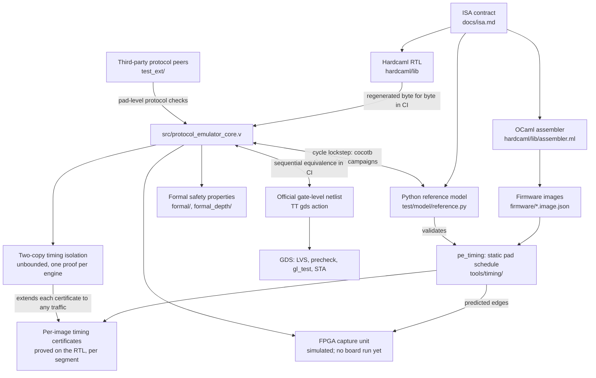

# Verification argument

This page summarizes how the design of record (the 8x4, four-engine core in
`src/`) is verified: what each layer shows, how strong that evidence is,
where it runs, and what it does not show. The numbers and their evidence are
in [results.md](results.md), cited by row (R*n*). The limits are set out in
full in [limitations.md](limitations.md). State as of 2026-09-29.

**The claim the chain is built to support.** Take a firmware image loaded
into an engine. Every owned pad of that engine changes only on clock edges
that a static analyzer predicts from the image. The edges are counted from
the engine's last synchronization point: START, or a completed `PULL`,
`PUSH`, `WAITPIN` or `WAITEVENT`. This holds whatever the other engines do,
and whatever the host does short of a reset or a command that starts,
stops, clears, reloads or re-owns that engine. It also carries over, at
clock-cycle level, to the netlist that the Tiny Tapeout flow builds. Three
pieces carry this claim:

1. an unbounded two-copy timing-isolation proof for each engine;
2. per-image timing certificates: the analyzer's schedule proved on the RTL;
3. sequential equivalence of the RTL and the official netlist, run in CI.

The other layers support functional correctness of the ISA implementation.
Section 5 lists what the chain assumes and what it leaves open.

## 1. The layers



- **One contract, three implementations.** [isa.md](isa.md) is the contract
  for the Hardcaml RTL, the OCaml assembler and the Python reference model.
  The RTL and the model run in cycle lockstep: on every clock the harness
  compares `uo_out`, `uio_out` and `uio_oe` ([test/README.md](../test/README.md)).
  The assembler produces the images that both execute. Its encodings are
  checked against golden words in its Hardcaml unit test, and its output is
  checked end to end by the protocol monitors and peers.
- **Timing isolation** ([formal/README.md](../formal/README.md),
  "Timing-isolation proof"). A miter of two complete processors with the IHP
  SRAM models shares engine K's image, its control commands and the pad
  inputs. The host traffic, the other engines and the mover are free in each
  copy. The proof shows that engine K's owned `uio_out`/`uio_oe` bits are
  identical in both copies until engine K completes a FIFO or event
  interaction.
- **Timing certificates** ([timing-certificates.md](timing-certificates.md)).
  For every segment between synchronization points of every image, a
  generator emits a SymbiYosys proof that the pads change exactly on the
  predicted edges, for all data values and pad inputs. Boundary lemmas chain
  the segments, and the isolation proof extends each certificate from its
  quiet environment to any environment.
- **Netlist equivalence** ([equivalence.md](equivalence.md)). A Yosys/ABC
  miter compares the RTL with the `tt_submission` netlist from reset, with
  the SRAM macros as cut points. It passes only on "equivalent": "undecided"
  fails. LVS then ties the layout to that netlist.

## 2. Claims and evidence

Strength: **proved, unbounded** holds for every reachable state or every
cycle, under the stated assumptions (k-induction, IC3/PDR, sequential
equivalence). **Proved, bounded** holds for all inputs up to depth N from
reset. **Proved per segment** is a complete bounded proof over each finite
segment. **Tested** is simulation on directed or random stimulus.
**Argued** is a written argument over separate proofs.

Where: **CI** is GitHub Actions; **cluster**, a committed result that the
scripts re-run on Slurm; **local**, `make reproduce` (`scripts/reproduce.sh`).

| Feature | What proves or tests it | Strength | Where |
|---|---|---|---|
| Instruction semantics (all opcode classes, `WAIT`/`XFER` timing, faults) | RTL vs model lockstep: 107 cocotb tests in the default suite (R28); 536,064 constrained-random cases, 0 failures (R20); `engine_safety` properties | Tested; `engine_safety` bounded (BMC 24) in CI, unbounded on the cluster (R32) | CI [`test.yaml`](../.github/workflows/test.yaml), [`formal.yaml`](../.github/workflows/formal.yaml); [`campaigns.json`](../campaigns/random/results/campaigns.json), [`summary.tsv`](../formal_depth/results/summary.tsv) |
| Host port protocol and read-back | Host-port atomicity and read snapshots (R34); lockstep tests; host library three-way differential fuzz, 100,000 seeds with RTL replay (R24) | Proved, unbounded (R34); tested | Cluster: [`summary.tsv`](../formal_depth/results/summary.tsv); local: `host/tests` |
| Program load (BEGIN, COMMIT, image length) | Control part (R35); SRAM data integrity `spec_word_*` (R35b); SRAM macro read-last-write lemma ([timing-certificates.md](timing-certificates.md) section 3) | Control: proved, unbounded. Data: bounded (BMC 48), with an argued unbounded chain | Cluster: [`summary.tsv`](../formal_depth/results/summary.tsv), [`cert/results`](../tools/timing/cert/results/) |
| TX/RX FIFOs | `fifo_conservation`: the ring buffer equals an independent shift-queue model | Proved, unbounded (IC3/PDR) | CI [`formal.yaml`](../.github/workflows/formal.yaml) (R30) |
| Mover (engine-to-engine transfers) | One grant per cycle, handshakes, word identity (`processor_invariants_prove`); conservation, quota and order (R36); round-robin bound (R37); `test_mover.py` with an independent arbitration monitor | Proved, unbounded; safety only, no liveness | CI [`formal.yaml`](../.github/workflows/formal.yaml); cluster [`summary.tsv`](../formal_depth/results/summary.tsv) |
| Pins: ownership, open drain, release on reset and fault | Masking invariants (`processor_invariants_prove`, `processor_inductive_prove`); `reset_safety` on the committed `src/`; fault stickiness, output-enable release, pin ownership (R38) | Proved, unbounded | CI [`formal.yaml`](../.github/workflows/formal.yaml) (R30); cluster (R38) |
| Timing isolation of each engine | `timing_isolation_prove_k0` to `_k3`; BMC 20 and 4 cover witnesses in CI; BMC 100 on the cluster (R31) | Proved, unbounded, under the assumptions in [formal/README.md](../formal/README.md) | CI [`formal.yaml`](../.github/workflows/formal.yaml) (R30) |
| Firmware timing: static schedule and protocol checks | `pe_timing` on the 26 design-of-record images and the flagship: protocol timing checks against the specifications, 252 PASS, 0 FAIL, 0 WARN, 65 INFO (R40c). For the 19 images of `24f31f0`: validated against the model on 1,193,441 engine runs (these images, six stress-suite images and random programs), with 35,303,947 of 35,303,947 pad changes on a predicted edge; 362 of the 363 path variants exercised, the other one argued infeasible (R41b). The 7 images added in `e64cd6b` were validated in separate runs: 752 engine runs over the 20 images of that tree, including `uart-rx-idle`, and 525 `uart-rx-idle` stress runs (R28), 747 with the SWD, WS2812B, PS/2 and 1-Wire images (R29) | Static analysis; validation tested | [`checks.json`](../tools/timing/report/checks.json), [`validation-summary.json`](../tools/timing/report/validation-summary.json); local `reproduce.sh --only timing` |
| Firmware timing: proved on the RTL | 350 of 350 segments of the 19 images committed at `24f31f0`, the 22 long ones also as 127 chunks, with 455 covers reached (R42b). The 7 images added in `e64cd6b` have no certificate yet; a cluster campaign on `6a3ea08` is to certify them ([timing-certificates.md](timing-certificates.md) section 8) | Proved per segment; the end-to-end composition is argued | Cluster: [`summary.json`](../tools/timing/cert/results/summary.json); [timing-certificates.md](timing-certificates.md) |
| Protocol behaviour at the pins | Peers vendored unmodified from third-party repositories (UART, SPI controller and target, SPI flash, I2C, a JTAG TAP): 65 of 65 tests at RTL and gate level, plus seeded campaigns (R22). The SWD, WS2812B, PS/2 and 1-Wire images: peers written in this repository from the cited specifications, 22 of 22 tests at RTL (R29) | Tested, with oracles independent of the model | [`test_ext/results/summary.json`](../test_ext/results/summary.json); local `reproduce.sh --only peers`; CI [`test.yaml`](../.github/workflows/test.yaml), job `protocols-ext` (`test/test_protocols_ext.py`) |
| Generated Verilog matches the Hardcaml source | `hardcaml/` + the config regenerate `src/protocol_emulator_core.v` byte for byte | Checked on every push | CI [`regen.yaml`](../.github/workflows/regen.yaml) (R10) |
| Hardcaml sources directly | Cyclesim and unit tests, `line_test`, and waveform expect tests whose recorded waveforms document the pin-level behaviour ([hardcaml/test/README.md](../hardcaml/test/README.md)) | Tested | CI [`regen.yaml`](../.github/workflows/regen.yaml), job `hardcaml-tests` (R26b) |
| Official netlist equals the RTL | `formal_eq/`: miter from reset, SRAM macros as cut points, ABC `dprove`; each run also checks 2 netlist mutants and 9 recipe controls | Proved (sequential equivalence from reset) | CI [`equiv.yaml`](../.github/workflows/equiv.yaml), after each `gds` and `gds_6x4` build of `main` since the workflow was added (R93); official builds of `d76f1cc` (R90); recipe history (R91) |
| Physical implementation | TT `gds` (route DRC 0, LVS 0), precheck, `gl_test` (46 pass, 56 skipped by design); STA met at 15 ns at all three corners; 50 MHz operating clock | Tool sign-off; `gl_test` is zero-delay | CI [`gds.yaml`](../.github/workflows/gds.yaml) (R85); 50 MHz re-analysis R86 |
| Behaviour on hardware | FPGA capture unit: pin edges counted in core cycles and compared with the `pe_timing` prediction; 9 of 9 simulated cases give the expected verdict | Simulated only; no board run; no silicon | [`scope-summary.json`](../demo/results/scope-summary.json); [demo.md](demo.md), "Experiment C" |

## 3. Checks that must fail

For each layer, a deliberately wrong input shows that the check can fail.

| Layer | Deliberate error | Outcome | Evidence |
|---|---|---|---|
| Lockstep checker | A bug injected into the reference model | Caught in 64 of 64 seeds; the minimizer reduces the case to one host operation | R21 |
| Timing isolation | Window exemption removed (`neg_pull`); mutated netlist (`neg_mutant`) | Both give a counterexample, on every CI run | [`formal.yaml`](../.github/workflows/formal.yaml) (R30) |
| `formal_depth/` harnesses | 13 mutants | Each caught on its named assertion | R39 |
| `pe_timing` | 7 deliberately wrong analyzers | 7 of 7 caught | R41b |
| Timing certificates | Certificates from wrong analyzers and from perturbed predictions (one edge early or late, a flipped level, a wrong successor state) | 132 of 132 fail, and 52 of 52 chunk-level ones | R42b; [timing-certificates.md](timing-certificates.md) sections 5 and 6 |
| Timing certificates | 5 RTL timing bugs | 3 caught. Of the other 2, one changes no pad and the other changes only data-dependent levels, which the certificates do not pin down | R42b; [timing-certificates.md](timing-certificates.md) section 6 |
| Netlist equivalence | A netlist with one cell function changed; a netlist with two SRAM data pins swapped; 9 recipe controls | Run with every check; each must give its expected verdict | [`equiv.yaml`](../.github/workflows/equiv.yaml) (R90, R91, R93) |
| Third-party peers | Wrong SPI mode substituted | 12 of 12 detected | R22 |
| FPGA capture analysis, in simulation | Cores with a deliberate timing coupling | All 5 cases expected to differ were reported different; the 4 expected to match did | [`scope-summary.json`](../demo/results/scope-summary.json) |
| Test suite as a whole | 2,420 single-bit mutants of the core | 96.82% killed: 2,223 of the 2,296 mutants not proven equivalent (2,420 − 124). Survivors that are argued but not proven stay in the denominator | R23c |

Controls like these, coverage accounting and review also found defects in the
verification infrastructure itself ([bug-ledger.md](bug-ledger.md)):

- the random generator ran `deselect` in 0.26% of cases instead of about
  10% (BL-8), and never produced five rejection paths (BL-9);
- a negative control counted as met on any failing assertion (BL-13), an
  earlier one was vacuous (BL-23), and the mover tag claims were vacuous
  from reset (BL-14);
- the first equivalence recipe compared an output bit only where the RTL
  value was 1. Its results are superseded, and the packaged recipe adds nine
  controls (R91).

## 4. Standard techniques and less common ones

- **Standard:** reference-model lockstep simulation; constrained-random
  stimulus with functional coverage; mutation analysis; BMC, k-induction and
  IC3 safety properties; RTL-to-netlist sequential equivalence checking;
  third-party protocol models.
- **Timing isolation** is a two-safety (non-interference) property, checked
  by self-composition. The ideas come from Goguen and Meseguer (1982),
  Barthe, D'Argenio and Rezk (2004), and Terauchi and Aiken (2005). UPEC
  (Fadiheh et al., DATE 2019) uses a two-copy miter on processors for a
  different property. The project-specific part is the application:
  cycle-exact pin timing, one engine at a time, of a complete processor with
  the vendor SRAM models, proved unbounded and run in CI.
- **Timing certificates** combine two known ideas:
  - a static schedule analysis in the spirit of WCET analysis (Wilhelm et
    al., 2008), except that it is exact rather than an upper bound;
  - a per-image proof of that schedule on the RTL, which resembles
    translation validation (Pnueli, Siegel and Singerman, 1998).

  Cycle-exact timing as a design goal has precedents in PRET machines
  (Edwards and Lee, 2007).
- **What is absent:** an instruction-level formal specification in the style
  of riscv-formal. The ISA is checked through the reference model, the
  properties and the peers, not against a formal ISA specification (section
  5).

## 5. What is not established

[limitations.md](limitations.md) has the full list. The points a reviewer is
most likely to raise are these.

- **No silicon, and no FPGA board run yet.** The capture-unit results come
  from simulation of the FPGA top, and the FPGA replaces the SRAM macro with
  a stand-in that is proved equivalent (R27). The host library has not run
  on hardware.
- **Common-mode risk in the oracle.** The RTL and the Python model come from
  the same specification and the same development process. A misreading
  shared by both passes every lockstep comparison, including the 536,064
  random cases, so those cases show agreement between the two, not ISA
  correctness. The checks that do not use the model as the reference are:
  - the third-party peers;
  - `pe_timing`'s protocol checks against the published specifications;
  - the formal properties.

  These cover pin-level protocol behaviour and selected properties, not the
  whole ISA.
- **The end-to-end timing claim is composed by hand.** The certificate
  chain, the premise that a host load produces the image, and the use of the
  isolation theorem are argued over separate proofs
  ([timing-certificates.md](timing-certificates.md) section 3). They are not
  one machine-checked proof. The program-load data-integrity step is bounded
  (BMC 48) in `formal_depth/`.
- **The certificates check timing and known levels, not data values.** A
  data pin is certified only as a set such as "0 or 1". One RTL bug of that
  kind passes all its certificates. The certificates cover the 19 images
  of `24f31f0` (R42b); the 7 images added in `e64cd6b` have none yet.
- **Proofs run on debug netlists.** Most processor proofs read
  `processor_fv.v`, `processor_debug.v` or the `formal_depth/` netlist: the
  same generator with observation ports added. `processor_fv.v` was proved
  sequentially equivalent to the committed `src/` top by
  `tools/timing/cert/equiv_src.py` (one cluster run, at `c118027`). For the
  others, equivalence is argued from the generator.
- **Bounded jobs and cluster-only evidence.** In CI, `engine_safety`,
  `processor_invariants_bmc`, `processor_inductive_bmc` and
  `timing_isolation_bmc` are bounded. The unbounded `formal_depth/` proofs,
  the third-party peers of `test_ext/`, the `pe_timing` report and its
  validation, and the host tests run on the cluster or locally, not in CI.
  CI runs the Hardcaml tests (`regen.yaml`, job `hardcaml-tests`) and
  `test/test_protocols_ext.py` on RTL (`test.yaml`, job `protocols-ext`). For the certificates, the `certs`
  workflow checks on every push that each committed image has a
  certificate for its current hash, and proves changed images whose proofs
  fit its budget of 200 runs; the full campaigns, and images over that
  budget, run on the cluster.
- **Gate-level simulation is partial and zero-delay.** It runs 46 of the
  107 tests of the default suite: the official runs so far had 102 tests,
  46 pass and 56 skip (R85), and the 5 `uart-rx-idle` tests added in
  `e64cd6b` skip at gate level too (R28). It runs without SDF and with the
  FUNCTIONAL SRAM models. Timing is covered
  by STA. The input and output delays in the constraints are an assumption
  (20% of the period), not derived from the Tiny Tapeout multiplexer or the
  board.
- **The equivalence check has a stated scope.** It does not cover the SRAM
  macros (cut points), liberty functions against cell layouts, or power-up
  values other than 0 of the 2,048 register bits without reset. ABC is
  trusted; no proof certificate is checked.
- **The mutation score has no held-out set.** The tests added to raise the
  score (`test_directed.py`, `test_kill_*`) were written from the survivors
  of the same mutant set they are scored on. Some kills rely on white-box
  time-warp tests, which deposit reachable counter values into RTL
  registers and run only on RTL. In the `c118027` gap closure, 82 of the 216
  new kills came only from them; several `test_kill_*` tests of the later
  push also use the warp.
- **The evidence spans revisions.** The random campaign, the peers and
  `formal_depth/` ran at `73536f0`, the certificates at `24f31f0` (earlier
  at `c118027`), the `pe_timing` validation of run r8 on the images of
  `fb79f31`, the `pe_timing` report on the 26 images of `e64cd6b`, and the
  mutation push with the test suite of `aa07868`. The RTL (`src/project.v`,
  `src/protocol_emulator_core.v`) is byte-identical from `73536f0` to
  `6a3ea08`; over that span, of the 19 images committed at `73536f0` only
  the three I2C controller images changed, and `e64cd6b` added 7 images.
  `firmware/ext/` holds the images of the extension variant
  ([extension.md](extension.md)), which this page does not cover.
- **No liveness claims.** The mover properties are safety only. Delivery
  depends on host service and on space at the destination.

## 6. How to reproduce

```sh
make reproduce          # quick tier: regen, lint, the cocotb RTL suite, 12 of the 16 formal jobs,
                        # the pe_timing report and the host tests (5 to 6 minutes on 2 CPUs)
make reproduce-full     # adds the other 4 formal jobs, the peers, variants, Hardcaml unit tests,
                        # timing validation and, with PDK_ROOT and GL_NETLIST set, gate level
```

- **Step list and toolchain:** [results.md](results.md) section 1.
- **CI on every push:** [`test.yaml`](../.github/workflows/test.yaml) (lint,
  the cocotb suite and, as its own job, `test/test_protocols_ext.py`),
  [`formal.yaml`](../.github/workflows/formal.yaml) (16 SymbiYosys jobs),
  [`regen.yaml`](../.github/workflows/regen.yaml) (the regeneration check
  and, as its own job, the Hardcaml tests),
  [`certs.yaml`](../.github/workflows/certs.yaml) (certificate staleness;
  proofs of changed images within its budget),
  [`consistency.yaml`](../.github/workflows/consistency.yaml) and
  [`gds.yaml`](../.github/workflows/gds.yaml) (gds, precheck, gl_test).
  After each `gds` and `gds_6x4` build of `main`,
  [`equiv.yaml`](../.github/workflows/equiv.yaml) checks the netlist.
- **Cluster-scale runs** have their own instructions: random campaigns
  ([campaigns/random](../campaigns/random/README.md)), mutation
  ([campaigns/mutation](../campaigns/mutation/README.md)), deep proofs
  ([formal_depth](../formal_depth/README.md)) and certificates
  ([tools/timing/cert](../tools/timing/cert/README.md) and
  [timing-certificates.md](timing-certificates.md) section 7).
